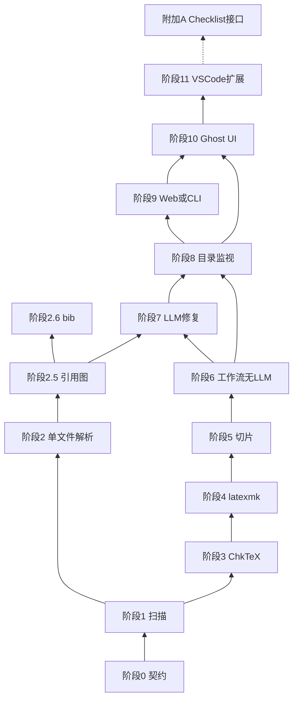
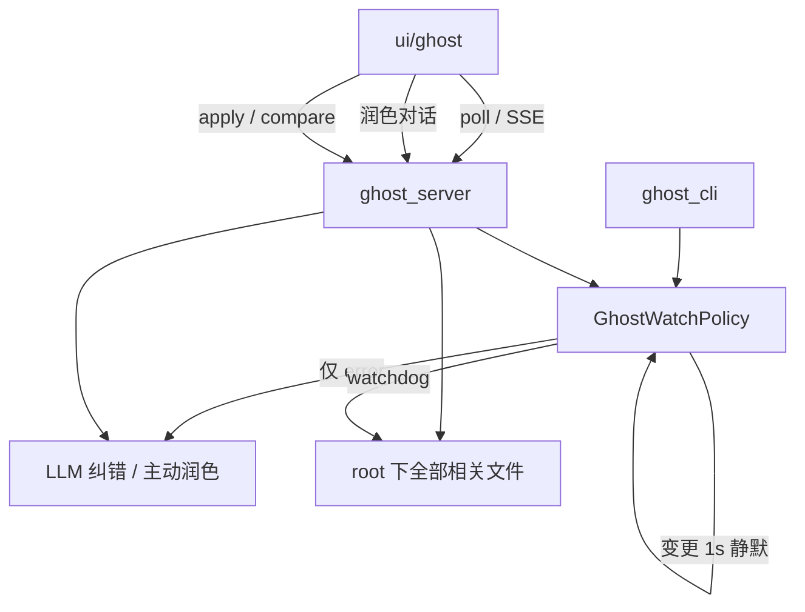
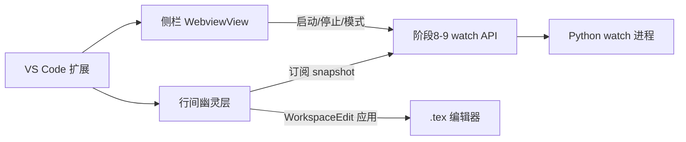

# TeX_Agent LaTeX 子系统分阶段实现路线图

> 版本：v0.7  
> 用途：在 [TeX_Agent LaTeX 诊断与润色子系统设计（增量版）.md](./TeX_Agent%20LaTeX%20诊断与润色子系统设计（增量版）.md) 之上，给出**自底向上、每步尽量少做**的落地顺序。  
> 原则：**先冻结契约 → 再纯函数/服务 → 再 Tool → 再工作流 → 再监视服务 → 再展示层（CLI/Web → 独立幽灵窗口 → VS Code 扩展）**。  
> **产品方向（v0.7）**：**当前迭代重心为阶段 10 演进**（Web 幽灵窗口：全项目监视、纠错卡、主动润色、应用/对比）；**阶段 11（VS Code 可安装扩展）暂缓实施**，仅保留架构与 `AgentBridge` 等接口，待 10 契约稳定后再迁入。**CLI / Web-UI（9）** 仍作人读列表通道。**Checklist** 与**目录批处理**不纳入 LaTeX 主路径。  
> **全程要求**：文件路径在 **Linux / Windows** 下行为一致；复杂仓库与引用体系分阶段补齐（见 §1.5、§二附表）。

---

## 一、实施原则（必读）

### 1.1 为什么要自底向上

上层（Web、VS Code、LangGraph 节点）都依赖**稳定的数据形状**。若先写 API 或 Agent，后期改 `DiagnosticIssue` 字段会导致全链路返工。

推荐依赖方向：

```text
契约 (Pydantic/dataclass)
  → 纯逻辑 (latex/* 无 IO)
  → 外部进程封装 (chktex/latexmk)
  → BaseTool 适配
  → workflow JSON
  → 目录监视服务 (watch + 防抖)
  → Web-UI / CLI 人读展示（阶段 9）
  → 独立幽灵窗口 Ghost UI（阶段 10，浏览器）
  → vscode-extension 可安装扩展（阶段 11）
```

### 1.2 每步「只做一件事」

| 建议 | 反例 |
|------|------|
| 本步只实现 ChkTeX 解析，不接 LLM | 第一步就写 `/api/latex/diagnose` + ReflectionAgent |
| 本步工作流只有 2 个 tool 节点 | 第一个 PR 就提交 8 个文件 + 扩展改动 |
| 本步用 pytest + 夹具验收 | 只靠手点 Web UI 验证 |

### 1.3 与现有仓库对齐的约定

- **Tool 输入**：继续用 JSON 字符串传入 `run()`（与 `PreflightInputsTool`、`RegisterInputsTool` 一致）。
- **Tool 输出**：`ToolResult.output` 放 JSON 字符串；结构化结果同时写入 `metadata[node_id]`（工作流节点约定）。
- **注册**：新工具加入 `tools/tool_list.py` 的 `_build_base_tools()`，用 `_safe_instantiate` 包裹，缺 TeX 时跳过而非拖垮整库。
- **metadata 键**：只增不改（`__latex_project__`、`__latex_diagnostics__` 等，见设计文档 §2.2）。
- **LLM**：编译修复用 **单轮 `SimpleAgent` + JSON**；润色再考虑 `ReflectionAgent`（Step B-1）。

### 1.4 推荐开发时的「垂直切片」方式

每个阶段结束后，应能用**一种最土的方式**跑通，例如：

```bash
pytest tests/test_latex/... -v
# 或
python -m cli ...   # 阶段后期
python -c "from latex.project_index import build_index; print(build_index('path'))"
```

不要等 Web UI 做完才第一次验证 Tool。

### 1.5 跨平台路径规范（Linux / Windows，全阶段适用）

自阶段 1 起，**禁止**用字符串拼接 `root + "\\" + rel` 或依赖当前 OS 分隔符写死逻辑；统一遵守：

| 规则 | 实现位置 | 说明 |
|------|----------|------|
| 磁盘读写 | `pathlib.Path` | `Path(root).expanduser().resolve()` 后再 `read_text` / `subprocess` 的 `cwd` |
| API / JSON 中的相对路径 | **正斜杠** `weijun/Intro.tex` | `latex/paths.normalize_rel_path()` |
| Tool 入参 | `path` **或** `root` + `rel_path` | `latex/paths.resolve_tex_file()`；`rel_path` 允许 `weijun\Intro.tex` |
| 输出中的 `file` / `rel_path` | POSIX 相对路径 | 与 VS Code / Web 前端无关 OS |
| 子进程 | 参数列表 `argv` | 不用 `shell=True` 拼接用户路径；`cwd` 为解析后的 `root` |
| 测试 | 夹具 + 双风格路径用例 | `tests/test_latex/test_paths.py`；复杂样本 `tests/test_latex/VaLoRA_TMC/` |

**后续阶段（3–11、附加 A）** 凡涉及 `root`、`main_tex`、log 内 `file:line` 映射，均复用 `latex/paths.py`，不得另起一套路径规则。

### 1.6 复杂仓库与「引用解读」能力分层

真实论文目录（如 `VaLoRA_TMC`）通常同时具备：**多 tex 根/子工程**、`\input` 树、**跨文件 `\ref`**、**\cite key**、**\bibliography{*.bib}**。能力分三层，避免「只开一个 tex」就期望看到完整引用信息：

| 层级 | 用户可见能力 | 阶段 | 单文件 `.tex` 是否够 |
|------|----------------|------|----------------------|
| **A. 文件图** | 有哪些 tex、谁 `\input` 谁、`main.tex` 候选 | **1**（已实现） | 否，需目录扫描 |
| **B. tex 内符号** | 章节、`\label`、`\ref`、`\cite{key}` 出现位置 | **2** + **2.5**（已完成） | 单文件 `structure.refs`；跨文件见 `ProjectIndex` |
| **C. 文献元数据** | key → 标题/作者（来自 `.bib`） | **2.6**（已完成） | 否，必须读 `.bib` |
| **D. 编译期真理** | 未定义 ref、Bib 未跑通、致命错误行号 | **4** + log 解析 | 否，需 `latexmk` |

**说明**：`\cite{zhu2023minigpt}` 在 tex 里只是一个 **key 字符串**；条目正文在 `reference.bib`，阶段 2 的 `structure.citations` **不等于** 参考文献内容。完整「解读」= B +（可选 C）+（可选 D）。

---

## 二、分层与阶段总览

```text
阶段 0  契约 + 常量                    [已完成]
阶段 1  项目扫描 (ProjectIndex)        [已完成]
阶段 2  单文件解析 (LaTeXParserTool)   [已完成]
阶段 2.5 全项目 label/ref/cite 索引   [已完成]
阶段 2.6 .bib 解析与 cite 对齐        [已完成]
阶段 2.7 导言区宏 / 版式 / 算法约定   [已完成]
阶段 3  TeX 环境探测 + ChkTeX          [已完成]
阶段 4  Latexmk + log 解析（含引用类警告） [已完成]
阶段 5  Issue 合并与源码切片          [已完成]
阶段 6  诊断工作流（无 LLM）          [已完成]
阶段 7  PromptBuilder + LLM 修复（L3，依赖 2.5 脏区级联） [已完成]
阶段 8  目录监视与实时诊断/建议（后台服务）     [已完成]
阶段 9  Web-UI / CLI 集成与展示                 [已完成]
阶段 10 独立幽灵窗口（Ghost UI，浏览器行间建议） [MVP 已完成；10.1–10.8 演进中]
阶段 11 VS Code / Cursor 可安装扩展（侧栏 + 编辑器内嵌） [暂缓；仅预留接口]
附加 A  Checklist 预留接口（可选，最后实现）     [未开始]
```



### 实现状态速查

| 阶段 | 状态 | 关键模块 |
|------|------|----------|
| 0 | 已完成 | `latex/models.py`, `constants.py`, `serialize.py` |
| 1 | 已完成 | `latex/project_index.py`, `latex/paths.py`, `tools/latex_project_tool.py` |
| 2 | 已完成 | `latex/structure_extract.py`, `syntax_check.py`, `tools/latex_parser.py` |
| 2.5 | 已完成 | `latex/refs_index.py` |
| 2.6 | 已完成 | `latex/bib_index.py` |
| 2.7 | 已完成 | `latex/conventions_index.py` |
| 3 | 已完成 | `latex/tex_env.py`, `latex/chktex_parser.py`, `latex/chktex_runner.py`, `tools/chktex_tool.py` |
| 4 | 已完成 | `latex/log_parser.py`, `latex/latexmk_runner.py`, `tools/latexmk_tool.py` |
| 5 | 已完成 | `latex/issues.py`, `latex/slice.py`, `latex/dirty.py`, `tools/latex_slice_tool.py` |
| 6 | 已完成 | `config/workflow/workflow_latex_diagnose_v0.json`, `tools/latex_merge_tool.py`, `tools/latex_report_tool.py` |
| 7 | 已完成 | `latex/prompt_builder.py`, `latex/suggestion.py`, `latex/fix_batch.py`, `workflow_latex_diagnose_v1.json`, `latex_fix_prepare` / `latex_collect_suggestions` |
| 8 | 已完成 | 目录监视、防抖增量诊断、空闲润色触发（见 §三 阶段 8） |
| 9 | 已完成 | Web-UI / CLI 启动监视、展示 issues / suggestions / 润色（见 §三 阶段 9） |
| 10 | MVP 已完成；**10.1–10.10 演进中** | `latex/ghost_*`, `ui/ghost/*`；见 §三 阶段 10（§10.1 起子计划） |
| 11 | **暂缓**（接口预留） | `vscode-extension/` + `AgentBridge` 规格保留；**不**排入当前迭代（见 §三 阶段 11） |
| 附加 A | 未开始 | Checklist 预留接口，不接论文审稿主流程（见 §三 附加阶段 A） |

**已取消 / 移出主路径（v0.3）**

| 原阶段 | 处理 |
|--------|------|
| 原阶段 8「润色工作流 + checklist」 | 拆入阶段 8 空闲润色；**不**读取 `thesis-checklists.md` |
| 原阶段 10「CLI 批处理」 | **从 LaTeX 辅助路线图移除**；一次性 `latex_diagnose_v0/v1` 仍可用 `main.py task`，非产品主路径 |
| 原阶段 11（仅扩展） | 拆为 **阶段 10**（独立 Ghost UI）+ **阶段 11**（VS Code 可安装扩展） |

**展示通道（v0.6，互不替代）**

| 通道 | 阶段 | 形态 | 用途 |
|------|------|------|------|
| **机器 / 人读列表** | 9 | CLI 表格、`watch` API、Web 页 | 摘要、Top-K issues、建议列表；可 `--json` |
| **幽灵窗口** | 10 | 浏览器 `http://127.0.0.1:8771/` | **主产品通道**：全项目纠错卡、主动润色对话、应用/对比/忽略；**当前迭代重点** |
| **编辑器内嵌** | 11 | Marketplace / VSIX 扩展 | **暂缓**；规格与接口预留，复用阶段 10 契约后实施 |

**其它路径**

| 路径 | 阶段 | 用途 |
|------|------|------|
| **一次性诊断** | 6–7（已完成） | `main.py task --wf latex_diagnose_v0/v1`：全库扫描；CI / 验证 L3 |
| **实时后端** | 8（已完成） | `WatchService`：防抖诊断 + 空闲润色；供 9/10/11 共用 |

阶段 7 的 `latex_report` JSON 供调试与 API；作者日常改稿优先 **阶段 10 幽灵窗口**（v0.7 起强化 Web 体验），**阶段 11** 待 10 稳定后再做，而非终端刷屏。

---

## 三、各阶段说明

以下每节包含：**目标**、**本步实现范围**、**建议新增/修改文件**、**接口要冻结什么**、**验收**、**本步明确不做**。

---

### 阶段 0：契约与包骨架（无业务 IO）— 已完成

**目标**：全项目对「问题 / 建议 / 项目图」说法一致；后续阶段只填实现，不改字段名。

**本步实现范围**

- 新建 `latex/` 包（可全部是先返回空列表的 stub）。
- 用 **Pydantic v2** 或 `dataclass` 定义：
  - `DiagnosticIssue`（对应设计文档 §6.1）
  - `Suggestion`（§6.2）
  - `ProjectIndex` / `ProjectFile` / `LabelRef`（§3.2 子集即可）
- `latex/constants.py`：`METADATA_KEYS`、`IssueSource`、`Severity` 枚举。
- `latex/serialize.py`：`to_json()` / `from_json()`，供 Tool 与测试复用。

**建议文件**

```
latex/__init__.py
latex/models.py          # DiagnosticIssue, Suggestion, ProjectIndex, ...
latex/constants.py
latex/serialize.py
tests/test_latex/test_models.py
```

**接口冻结（本阶段末不应再改）**

- `DiagnosticIssue.id` 生成规则：`{source}:{rel_path}:{line}:{column}`
- `Suggestion.range` 与 VS Code 一致：`line`/`character` 0-based
- metadata 键名常量

**验收**

```bash
pytest tests/test_latex/test_models.py -v
```

**本步不做**：chktex、latexmk、LangGraph、FastAPI。

---

### 阶段 1：项目扫描（ProjectIndex，P0 解析）— 已完成

**目标**：用户给一个目录（路径兼容 Linux / Windows），得到 `main.tex` 候选、文件依赖图、文件 checksum。

**已实现**

- `latex/project_index.py`：`build_project_index()`、`extract_inputs()`、`iter_tex_files()`
- `latex/paths.py`：`normalize_rel_path()`、`resolve_tex_file()`（**全阶段路径入口**）
- `tools/latex_project_tool.py`：入参 `root`；可选 `main_tex`（正斜杠或反斜杠均可）

**复杂目录行为说明（以 `tests/test_latex/VaLoRA_TMC` 为例）**

| 现象 | 是否正常 | 处理建议 |
|------|----------|----------|
| 扫描到 20+ 个 `.tex`，含 `weijun/`、`Response/` | 是 | 文件图包含全部 tex |
| 多个 `\documentclass` → `main_tex=None` | 是 | 调用方传 `"main_tex":"paper.tex"`（可与 `Makefile` 中 `P=paper` 一致） |
| `paper.tex` → 16 个 `\input{weijun/...}` 边齐全 | 是（指定 main 后） | 主论文闭包约 17 个文件 |
| `Highlight.tex` 等与 `paper.tex` 不连通 | 是 | 视为**并行子工程/碎片**，非 bug |
| 注释掉的 `% \input{42copy}` 仍出现边 | 阶段 1 局限 | 阶段 1 小改：去注释后再抽 `\input`；或阶段 6 后 |
| 不扫描 `.bib` / `.cls` | 阶段 1 范围 | `.bib` 见 **阶段 2.6** |

**验收（已通过）**

- `tests/fixtures/latex/multifile/`
- `tests/test_latex/test_project_index.py`
- 手工：`build_project_index(".../VaLoRA_TMC", main_tex="paper.tex")`

**本步不做**：`\label`/`\ref` 全项目图（→2.5）、ChkTeX、Web API。

---

### 阶段 2：单文件结构解析（LaTeXParserTool MVP）— 已完成

**目标**：对**单个** `.tex`（通过 `path` 或 `root`+`rel_path`，跨平台）提取章节、轻量语法、可选 AST。

**已实现**

- `tools/latex_parser.py`：`LaTeXParserTool`（`latex_parser`）
- `latex/structure_extract.py`：`\section` 等、`\label`、`\cite{key}`（**仅 key 列表**）、`figure`/`table` 环境
- `latex/syntax_check.py`：括号、` \begin/\end` 顺序
- `latex/ast_parse.py`：`pylatexenc`（`requirements.txt` 已声明）
- 单文件 `structure` **不含** `\ref{...}` 列表（留给 2.5 统一建模）

**推荐验收样本**

```json
{"root": "tests/test_latex/VaLoRA_TMC", "rel_path": "weijun/Intro.tex"}
{"root": "tests/test_latex/VaLoRA_TMC", "rel_path": "weijun\\Appendix.tex"}
```

| 文件 | 阶段 2 可解析 |
|------|----------------|
| `weijun/Intro.tex` | 章节 + 大量 `\cite{key}`（**非** bib 正文） |
| `weijun/Appendix.tex` | `\label`（如 `fig:templatepdf`）；**尚不输出** 第 50 行 `\ref{fig:templatepdf}` |
| `paper.tex` | 前言区 + `\bibliography{reference.bib}` 字符串（**不打开** bib） |

```bash
pytest tests/test_latex/test_paths.py tests/test_tools/test_latex_parser.py -v
```

**本步明确不做**

- 全项目 `ProjectIndex.labels` / `refs` 填充（→ **2.5**）
- `.bib` 条目字段（→ **2.6**）
- 跨文件「`\ref` 是否指向已定义 `\label`」（→ **2.5** + 可选 **4** 编译 log）

---

### 阶段 2.5：全项目 label / ref / cite 索引（引用结构）— 已完成

**目标**：在**目录 + 主文件闭包**（或全项目 tex）上构建引用图，支撑复杂仓库的「解读」与阶段 7 脏区级联；路径规则同 §1.5。

**本步实现范围**

- 新建 `latex/refs_index.py`（建议）：
  - 遍历 `ProjectIndex.files` 或 `main_tex` 可达闭包内每个 tex
  - 逐行去注释后匹配：`\label`、`\ref` / `\eqref` / `\pageref`、`\cite` / `\citep` 等
  - 填充 `ProjectIndex.labels: Dict[str, LabelDef]`（key → 定义文件与行号）
  - 填充 `ProjectIndex.refs: List[RefEntry]`（含 `kind`: `ref` | `cite`）
- 扩展 `build_project_index()` 或 `enrich_project_index(index)` 一步完成
- 可选诊断（纯本地）：
  - `ref` 指向未定义 `label`
  - `cite` key 在 tex 中出现但 **2.6 未做前** 不校验 bib 是否存在
- 单文件 `latex_parser` 的 `structure` 可增加 `refs: [...]`，与 2.5 字段对齐

**与阶段 2 的分工**

| 项目 | 阶段 2 | 阶段 2.5 |
|------|--------|----------|
| 范围 | 当前 tex | 项目内多 tex（建议 main 闭包） |
| `\label` | `structure.labels[]` | `ProjectIndex.labels` 全局字典 |
| `\ref` | 不输出 | `ProjectIndex.refs` + 未定义检测 |
| `\cite` key | `structure.citations[]` | `RefEntry(kind=cite)` + 可对接 2.6 |

**验收**

- 夹具 `tests/fixtures/latex/cross_ref/`（`main.tex` + 子文件）
- **集成**：`VaLoRA_TMC` + `main_tex=paper.tex`
  - `Appendix.tex` 中 `\ref{fig:templatepdf}` 与 `weijun/LoRAGeneration.tex` 等处的 `\label{fig:VaLoRA}` 可跨文件关联
  - 未定义 ref 产出 `DiagnosticIssue(source=parser)`（可选）
- `tests/test_latex/test_refs_index.py`；路径用例含 `rel_path` 反斜杠

**本步不做**：解析 `.bib` 正文（→2.6）、编译验证（→4）。

**优先级**：建议在 **阶段 6 之前**完成；阶段 7 的跨章节脏区依赖此图。

---

### 阶段 2.6：Bibliography（.bib）解析与 cite 对齐 — 已完成

**目标**：把 tex 中的 `\cite{key}` 与 `reference.bib`（及 `\bibliography{}` 声明）对齐，提供**文献元数据解读**；仍不替代 BibTeX 编译。

**背景**：像 `VaLoRA_TMC` 这类项目，引用信息主要在 `reference.bib`（数千行），**仅解析单个 tex 永远看不到标题/作者**。

**本步实现范围**

- `latex/bib_index.py`：
  - 从 `main.tex` 解析 `\bibliography{foo}` / `\addbibresource`（首版可只支持 `.bib`）
  - 在 `root` 下解析 `foo.bib`（路径用 `resolve_tex_file` / `normalize_rel_path`）
  - 提取 `@article{key, ...}` 等条目的 `key`、`title`、`author`（MVP 正则或 `bibtexparser` 可选依赖）
- 扩展 `ProjectIndex` 或 metadata：
  - `bibliography_files: list[str]`
  - `bib_entries: Dict[str, BibEntry]`（新建轻量模型，阶段 0 可加 `BibEntry`）
- 诊断：tex 中 `\cite{missingKey}` 但 bib 中无条目 → `DiagnosticIssue` warning

**验收**

- `VaLoRA_TMC`：`Intro.tex` 中 cite key 能在 `reference.bib` 中找到条目（抽样 ≥5 个）
- 故意缺失 key 产生 warning

**本步不做**：BibTeX 样式、`.bbl` 生成、多 bib 合并策略（可后续补）。

**依赖**：2.5 的 cite 索引；路径仍走 `latex/paths.py`。

---

### 阶段 2.7：导言区宏 / 版式 / 算法约定 — 已完成

**目标**：识别项目「方言」——`paper.tex` 导言区的 `\newcommand`、`\renewcommand`、`\newtheorem`、`\usepackage`、算法 `Input/Output` 标签改写，以及正文中的宏用法与局部 `\setlength`。

**已实现**

- `latex/conventions_index.py`：`parse_preamble()`、`build_conventions()`、`enrich_conventions()`
- `ProjectIndex.conventions`：`ProjectConventions`（宏定义 + `expands_to_hint` 语义提示 + `macro_usage` + `local_typography`）
- 默认随 `build_project_index(enrich=True)` 一并填充

**本步不做**：完整 TeX 宏展开、`.cls` 深度解析、ChkTeX 规则定制（可后续与阶段 3 联动）。

---

### 阶段 3：TeX 环境探测 + ChkTeXTool — 已完成

**目标**：本地静态诊断 L1；无 TeX 时优雅降级。

**已实现**

- `latex/tex_env.py`：`probe_tex_env()` → `TexEnvStatus`
- `latex/chktex_parser.py`：解析 `-v0` / `-v1` / lacheck 行 → `DiagnosticIssue`
- `latex/chktex_runner.py`：`run_chktex()`，argv 列表、`cwd=root`、单文件超时
- `tools/chktex_tool.py`（`chktex`）：已注册 `tool_list`；metadata `__latex_diagnostics__`
- `config/settings.py`：`latex_chktex_timeout_sec` 等（可用环境变量覆盖）

**验收**

```bash
pytest tests/test_latex/test_chktex_parser.py tests/test_latex/test_tex_env.py tests/test_tools/test_chktex_tool.py -v
pytest -m integration tests/test_tools/test_chktex_tool.py -v  # 需本机 chktex
```

**本步不做**：latexmk、工作流、LLM。

---

### 阶段 4：LatexmkTool + log 解析（L2 fast）— 已完成

**目标**：试编译并产出 `DiagnosticIssue(source=latexmk)`；**编译期**未定义引用、文献引用警告以 log 为准（补充 2.5/2.6 静态分析）。

**已实现**

- `latex/log_parser.py`：`parse_latex_log()`（`!` 错误、`l.N`、`file.tex:line:`、未定义 ref/cite）
- `latex/latexmk_runner.py`：`run_latexmk()`，argv 列表、`cwd=root`、fast/full 模式
- `tools/latexmk_tool.py`（`latexmk`）：已注册；输出 `issues`、`success`、`log_tail`

**验收**

```bash
pytest tests/test_latex/test_log_parser.py tests/test_tools/test_latexmk_tool.py -v
pytest -m latex_integration tests/test_tools/test_latexmk_tool.py::test_latexmk_integration_broken_braces -v
```

**本步不做**：多轮 latexmk 收敛说明 UI、LLM、Web。

---

### 阶段 5：Issue 合并与源码切片 — 已完成

**目标**：为 L3 准备「报错行 ±N 行」上下文；仍不调用 LLM。

**已实现**

- `latex/issues.py`：`merge_issues()` / `merge_issue_lists()`（同文件同行同源保留 severity 最高）
- `latex/slice.py`：`IssueSlice`、`slice_around_issue()`、`slice_issues()`
- `tools/latex_slice_tool.py`（`latex_slice`）：已注册 `tool_list`；支持 `issues` / `issue_ids` / `severity` 过滤
- `latex/dirty.py`：`compute_file_dirty()`、`baseline_from_index()`（文件级 checksum，写入 `__latex_dirty__` 占位）
- `config/settings.py`：`latex_slice_context_lines`（默认 10）

**接口冻结**

- `IssueSlice`：`issue_id`、`file`、`start_line`、`end_line`、`snippet`、`context_lines`

**验收**

```bash
pytest tests/test_latex/test_merge_issues.py tests/test_latex/test_slice.py tests/test_latex/test_dirty.py -v
```

**本步不做**：Prompt、Agent。

---

### 阶段 6：诊断工作流（无 LLM）— 已完成

**目标**：用现有 LangGraph 串起阶段 1–5；用户通过 `main.py` / Web 选 workflow 即可拿到 issues JSON。

**已实现**

- `config/workflow/workflow_latex_diagnose_v0.json`（**v0 无 Agent**，纯 Tool 链）：
  1. `latex_project` → 2. `chktex` → 3. `latexmk` → 4. `latex_merge` → 5. `latex_slice`（仅 `severity=error`）→ 6. `latex_report`
- `config/workflow_registry.json` 已注册 `latex_diagnose_v0`
- `tools/latex_merge_tool.py`、`tools/latex_report_tool.py`；`workflow/nodes.py` 将 Tool 产出的 `__latex_project__` / `__latex_diagnostics__` 提升到顶层 metadata

**用户输入（task 参数）**：JSON 字符串，至少含 `root`；建议同时传 `main_tex`（latexmk 必填或可由扫描推断）。

**验收**

```bash
pytest tests/test_workflow/test_latex_diagnose_v0.py -v -m "not slow"
python main.py task --wf latex_diagnose_v0 "{\"root\":\"tests/fixtures/latex/multifile\",\"main_tex\":\"main.tex\"}"
```

**本步不做**：`/api/latex/*`、LLM fix、润色。

---

### 阶段 7：PromptBuilder + L3 修复（单轮 SimpleAgent）— 已完成

**目标**：对**每条** error 级 issue 生成 0–1 条 `Suggestion`；控制 Token。

**已实现**

- `latex/prompt_builder.py`：`build_fix_prompt()`、`build_project_meta()`、`collect_ref_context_snippets()`（2.5 引用图：issue 附近 `\ref` → `\label` 定义处跨文件片段）
- `latex/suggestion.py`：`parse_llm_suggestion_json()`、`parse_llm_suggestions_from_agent_result()`（容错 Agent 包装 JSON）
- `latex/fix_batch.py`：`select_error_issues()`、`build_fix_batch()`（最多 `settings.latex_llm_max_issues_per_run`，默认 5）
- `latex/fix_agent_prompt.py`：`LATEX_FIX_AGENT_SYSTEM_PROMPT`（供节点 config 参考）
- `tools/latex_fix_prepare_tool.py`（`latex_fix_prepare`）：确定性组装 `fix_batch` + `prompt_bundle`，**不调用 LLM**
- `tools/latex_collect_suggestions_tool.py`（`latex_collect_suggestions`）：解析 `fix_agent` 输出 → `Suggestion[]`，写入 `__latex_suggestions__`
- `tools/latex_report_tool.py`：支持 `suggestions_output`、`workflow=latex_diagnose_v1`，report 含 `suggestions` / `suggestion_count`
- `config/workflow/workflow_latex_diagnose_v1.json`，注册名 `latex_diagnose_v1`：
  - 链：`latex_project` → `chktex` → `latexmk` → `latex_merge` → `latex_slice(error)` → `latex_fix_prepare` → `fix_agent` → `latex_collect_suggestions` → `latex_report`
  - `fix_agent`：`SimpleAgent`，`temperature=0.2`，`result` 字段为 Suggestion 数组；`max_issues: 5` 在 `latex_fix_prepare` 节点 config
- `workflow/nodes.py`：Tool metadata 提升增加 `__latex_suggestions__`
- `tools/tool_list.py`：注册新 Tool

**接口（已冻结 / 扩展）**

- `Suggestion.issue_id`：关联 `DiagnosticIssue.id`（阶段 0 已有可选字段）
- metadata：`__latex_suggestions__`（`constants.py` 常量）

**用户输入（CLI / Web task）**

与 v0 相同，至少 `root` + 建议 `main_tex`；选用工作流 **`latex_diagnose_v1`**（需配置 LLM API Key）。

```bash
python main.py task --wf latex_diagnose_v1 "{\"root\":\"tests/fixtures/latex/multifile\",\"main_tex\":\"main.tex\"}"
```

**验收（已通过）**

```bash
pytest tests/test_latex/test_prompt_builder.py tests/test_latex/test_suggestion.py tests/test_latex/test_fix_batch.py -v
pytest tests/test_workflow/test_latex_diagnose_v1.py -v -m "not slow"
# 端到端（Mock Agent，需 openai 等依赖，否则 skip）：
pytest tests/test_workflow/test_latex_diagnose_v1.py::test_latex_diagnose_v1_invoke_mocked -v -m slow
```

**与 v0 的关系**

- `latex_diagnose_v0` 保持不变（无 LLM、无 suggestions），供 CI / 无 API 环境。
- v1 在 v0 工具链后追加 L3；无 error 或无切片时 `fix_batch` 为空，流水线仍可跑通。

**运行预期与局限（v0.4，避免误用 v1）**

| 项 | 说明 |
|----|------|
| **唯一 LLM 节点** | `fix_agent`（`SimpleAgent`）；**不**含润色 Agent |
| **触发 L3 的条件** | 合并后存在 `severity=error` 且 `latex_slice` 能产出对应切片；否则 `suggestion_count=0`，**流水线仍成功** |
| **warning 不调 LLM** | ChkTeX / parser / latexmk 的 **warning** 仅出现在 `diagnostics.issues`；不进 `fix_batch` |
| **无润色** | `source=llm_polish`、空闲润色属于 **阶段 8**；勿把 v1 当润色工作流 |
| **LLM 产出形态** | `Suggestion`：`replacement`（必填）为带 `range` 的 **LaTeX 补丁** + `rationale_zh`；`issue_id` 关联 error |
| **`latex_report` 定位** | **机器契约** / 调试 / 阶段 9 输入；当前 embed **全量** `issues` 属有意设计，**非**作者终态 UI |
| **大库典型现象** | 如 `VaLoRA_TMC`：`issue_count` 可达数百（多为 ChkTeX warning），`suggestions` 仍可为空；验证 L3 宜用 `broken_braces.tex` 或含真实 **error** 的样本 |

**本步不做**：Reflection 多轮、目录监视（→8）、Web/CLI 人读展示（→9）、独立幽灵窗口（→10）、VS Code 扩展（→11）、`latex_report` 人读渲染（→9）。

**说明**：阶段 7 中的 `fix_batch` 仅用于**单次工作流内**限制 LLM 处理条数，不是「目录批处理」产品能力；路线图不再规划独立的 LaTeX 批处理阶段。

---

### 阶段 8：目录监视与实时诊断/建议（后台服务） — 已完成

**目标**：用户指定 LaTeX 目录后，后台进程**持续监视**文件变更，在 Web-UI 或 CLI 可订阅的通道上推送：**问题说明**、**修改建议**（纠错）、**润色建议**（空闲时）。本阶段只做服务与数据流，不做编辑器 UI。

**本步实现范围**

| 能力 | 行为 |
|------|------|
| **目录监视** | 监视 `root` 下 `.tex` / 相关 `.bib`（可配置 glob）；跨平台用 `watchdog` 或等价方案；`main_tex` 与阶段 1 一致 |
| **变更 → 诊断** | 文件保存或内容变更后**防抖**（建议 300–800ms，可配置）：增量跑 ChkTeX / 可选 latexmk（重编译可更长防抖或手动触发）→ `merge_issues` → 变更涉及 error 时走 v1 链路片段或轻量 `latex_fix_prepare` + Agent |
| **空闲 → 润色** | 用户**连续 N 秒无修改**（默认 **2s**，可配置）后，对**当前活跃文件**或光标所在 `section` 调用润色 Agent；输出 `Suggestion(source=llm_polish)`，`replacement` 可为空，以 `rationale_zh` 为主 |
| **状态推送** | 统一事件模型：`diagnostics_updated`、`suggestions_updated`、`polish_suggestions_updated`；含 `project_version` / 文件 checksum，供 UI 去重 |
| **进程模型** | 独立模块如 `latex/watch_service.py`；可由 CLI `tex-agent watch` 或 Web 子进程拉起；单 `root` 单实例（同目录重复启动则 attach 或拒绝） |

**建议新增/修改文件**

```
latex/watch_service.py      # 监视 + 防抖调度
latex/polish_prompt.py      # 空闲润色 prompt（无 checklist）
latex/watch_events.py       # 事件 / 快照模型（可并入 models）
# 可选：workflow_latex_watch_v1.json 或直接在服务内调 Tool 链，避免 LangGraph 过重
```

**接口要冻结**

- 监视配置：`root`、`main_tex`、`idle_polish_sec`（默认 2）、`diagnose_debounce_ms`、`enable_latexmk_on_watch`
- 推送 payload：`issues[]`、`suggestions[]`（纠错）、`polish_suggestions[]`（润色），字段仍用阶段 0 契约
- **不**在本阶段引入 checklist 文件路径或 `file_loading` 读审稿清单

**验收**

```bash
# 启动监视（CLI 形态示例）
python -m latex.watch_cli --root tests/fixtures/latex/multifile --main_tex main.tex
# 修改 tex → 2s 内应看到 diagnostics；停笔 2s → 应看到 polish 事件（Mock LLM 单测）
pytest tests/test_latex/test_watch_service.py -v
```

**本步明确不做**

- Web 页面布局、幽灵窗口（→10）、VS Code 扩展（→11）
- 接入论文审稿 **checklist** 工作流（→附加阶段 A）
- 对多个无关目录的**批处理扫描**、定时全库 cron 报告
- 独立 `workflow_latex_polish_v1` + `thesis-checklists.md` 方案（已废弃）

---

### 阶段 9：Web-UI / CLI 集成与展示 — 已完成

**目标**：用户在 **Web-UI** 或 **CLI** 中**启动/停止**阶段 8 的监视服务，并**查看**问题说明、修改建议、润色建议。这是当前阶段的**短期产品目标**；不要求编辑器内嵌。本阶段交付 **人读视图**，与阶段 7 的机器 JSON 分离。

**人读视图 vs 机器 JSON（本阶段核心交付）**

| 层级 | 内容 | 暴露方式 |
|------|------|----------|
| **机器层** | 完整 snapshot / `latex_report`（含全量或分级 issues） | CLI/Web 的 `--json`、落盘、Agent 间传递 |
| **人读层** | 摘要 + 可操作条目 | CLI 默认 / Web 主界面 |

人读层建议包含：

- **摘要**：`error` / `warning` 计数、按 `source`（chktex / latexmk / parser）统计。
- **问题列表（可截断）**：默认 **Top-K** warning（如 20）+ **全部 error**；提供「展开全量」或链到 JSON 文件。
- **修改建议**：**全部** `suggestions`（`file`、行号、`rationale_zh`、`replacement` 预览）。
- **润色建议**：**全部** `polish_suggestions`（阶段 8 产出；`replacement` 可为空）。

可参考审稿工作流 `workflow_checklist_text_v3` 的 **`final_report`**（自然语言总结 + 路径）；LaTeX 宜增加确定性 **`latex_report_view`** Tool 或 CLI `--human`，**不必**在阶段 7 用额外 Agent 塞总结（避免与 watch 重复）。

**一次性诊断也走人读层**：`main.py task --wf latex_diagnose_v1` 完成后，除原始 JSON 外，阶段 9 提供同一套简短终端/Markdown 输出（不必等 watch）。

**report 契约扩展（规划，实现于本阶段）**

在保持阶段 0 字段兼容前提下，可为 view 层增加（不改变 `DiagnosticIssue` / `Suggestion` 本体）：

- `report.summary`：`{ "error": n, "warning": n, "by_source": {...} }`
- `issues_top_k` + 可选 `issues_full_ref`（路径或内联），减轻默认 payload 体积。

**本步实现范围**

**CLI**

- 子命令：`watch start | stop | status`（或等价），参数：`--root`、`--main_tex`、`--idle-polish-sec`
- **默认人读**：表格或分页（摘要 + Top-K issues + 全部 suggestions / polish）；**`--json`** 输出完整 snapshot 供脚本
- 一次性诊断：`task` 跑完 v0/v1 后可选 `--human`（或默认简短、`-v` 全量 JSON）
- 可选：TTY 下简单高亮 severity；**不**实现「扫一遍目录写 report.json 退出」的批处理 CLI

**Web-UI**

- 启动监视：`POST /api/latex/watch`（body：`root`, `main_tex`, …）→ `watch_id`
- 停止 / 状态：`DELETE /api/latex/watch/{id}`、`GET /api/latex/watch/{id}`
- 订阅更新（二选一，首版可只做 b）：
  - a) `GET /api/latex/watch/{id}/events` SSE
  - b) `GET /api/latex/watch/{id}/snapshot` 轮询（含最新 issues + suggestions + polish）
- 页面区域：问题列表 | 修改建议 | 润色建议（三栏或 Tab）；展示 `rationale_zh`、`replacement`（若有）
- 与现有 `/api/chat` 解耦；监视会话内存存储即可（与旧「一次性 Job API」可复用 `job_store` 模式，但语义改为 **watch**）

**接口冻结**

- `WatchSession`：`watch_id`、`root`、`status`（`running` | `stopped` | `error`）、`last_event_at`
- Snapshot JSON 与阶段 8 事件模型一致

**验收**

- CLI：启动 watch → 改文件 → 终端或 `--json` 收到 diagnostics；停笔 2s 收到 polish
- Web：`curl` 创建 watch → 轮询 snapshot 含三类数据；前端手动联调一页即可

**本步不做**

- 行间幽灵卡片 UI（→**阶段 10**，独立浏览器，非本 Web 主站）
- VS Code / Cursor 可安装扩展（→**阶段 11**）
- Checklist 勾选 UI（→附加阶段 A）

---

### 阶段 10：独立幽灵窗口（Ghost UI，浏览器行间建议）

**总目标**：在**不安装 VS Code 扩展**的前提下，用专用浏览器页作为 LaTeX 改稿的**主交互面**——展示项目内**任意相关文件**源码、**行间幽灵卡**（纠错 / 主动润色）、**应用 / 对比 / 忽略**，并与本地编辑器（VS Code / Cursor 等）**并行写盘**。监视与建议生成以**整个 LaTeX 项目目录（`root`）**为范围，**不限于 `main_tex` 单文件**；子文件报错或润色卡须出现在**该子文件**对应的 Ghost 视图中。

**版本划分**

| 子版本 | 状态 | 内容 |
|--------|------|------|
| **10.0 MVP** | 已完成 | 单端口 Ghost、`WatchService` 内嵌、`.tex` 文件选择、轮询 snapshot、纠错+空闲润色卡、应用/忽略、`apply_edit` |
| **10.1+ 演进** | **当前计划** | 见下文 §10.1–§10.10；**阶段 11 暂缓** |

**与阶段 9 的分工**

| 阶段 9 | 阶段 10 |
|--------|---------|
| CLI 人读 / Web `api/latex/watch` | 独立端口 **Ghost UI**（默认 `8771`，与 Web `8765` 分离） |
| 列表、摘要、Top-K | 行号对齐源码 + 浮动卡片 + 文件树选择器 |
| 可复制建议 | **应用 / 对比 / 忽略** → `apply_edit` / `apply_compare` 写回磁盘 |

**与阶段 8 监视的关系（10.1 起 Ghost 专用策略）**

Ghost 启动时**不再**沿用阶段 8 默认的「保存/变更防抖 + 空闲 2s 自动润色」全套行为，而是在 `ghost_cli` / `ghost_server` 侧使用 **`GhostWatchPolicy`**（可包装 `WatchService` 或子类）：

| 维度 | 阶段 8（通用 watch，供 9 等） | 阶段 10 Ghost（10.1 目标） |
|------|------------------------------|----------------------------|
| 润色 | 空闲 N 秒自动 `polish_suggestions` | **关闭自动润色**；仅用户主动对话（§10.3） |
| 首次检查 | 同左 | 启动后**立即**全项目 ChkTeX + 可选 latexmk；有 **error** 则走 Agent 产出纠错建议 |
| 后续检查 | 防抖后重复诊断+润色 | **仅当** `root` 下监视 glob 内文件有**内容变更**；**1s 静默**（无新写入）后触发诊断+编译；**无新 error** 则不刷新幽灵 UI |
| 幽灵卡增量更新 | — | 旧卡锚点**未被用户改掉**且该位置**无新 error** → **保留**旧卡；锚点文本被改且仍有 error → **刷新**该卡 |
| 无用户修改 | 仍可能空闲润色 | **不做**任何检查，直到目录内再次出现文件变更 |

**架构（10.1 目标）**

```text
python -m latex.ghost_cli --root … --main-tex paper.tex
  → GhostWatchPolicy（全 root 监视 .tex/.bib/…；1s 静默防抖；无自动润色）
  → 启动：全项目 diagnose + compile → error → LLM fix suggestions
  → FastAPI ghost_server
  → ui/ghost/：项目文件树 + 源码行 + 纠错卡（红）/ 润色卡（绿）+ 润色对话框
  → POST apply | apply_compare | dismiss；警告单独面板（§10.8）
```



**已实现（10.0 MVP，保留不删）**

| 模块 | 说明 |
|------|------|
| `latex/watch_service.py` | 通用监视（10.1 将由 Ghost 策略包装或分支） |
| `latex/ghost_server.py` | Ghost HTTP |
| `latex/ghost_cli.py` | 入口 |
| `latex/apply_edit.py` | 按 `range` **替换**写回（10.1 需排查乱码/重复行 bug，见 §10.9） |
| `ui/ghost/` | 行间卡、应用/忽略 |
| `tests/test_latex/test_apply_edit.py`、`test_ghost_server.py` | 单测 |

---

#### 10.1 实施优先级与步骤总览

| 优先级 | 编号 | 主题 | 依赖 |
|--------|------|------|------|
| **P0** | 10.2 | Ghost 监视策略（静默 1s、无自动润色、增量保留幽灵卡） | 阶段 8 |
| **P0** | 10.3 | 主动润色对话框（与纠错分离） | 10.2 |
| **P0** | 10.4 | error / warning 分离（warning 不进 LLM 纠错链） | 10.2 |
| **P1** | 10.5 | 纠错幽灵卡布局与字段契约 | 10.4 |
| **P1** | 10.6 | 卡片锚点、红/绿行内高亮、操作后清除 | 10.5、10.3 |
| **P2** | 10.7 | 项目文件树 + 选择器红点/绿点 | 阶段 1 `ProjectIndex`、snapshot 元数据 |
| **P3** | 10.8 | 警告可选查看面板（LLM 仅释义） | 10.4 |
| **P0** | 10.9 | 应用 bug 修复 + **对比**模式 | 10.5 |
| **贯穿** | 10.10 | 全项目（多 tex / bib）范围确认 | 各步验收 |

**推荐落地顺序（单 PR 尽量垂直切片）**

1. **PR-10a**：`GhostWatchPolicy` + 关闭 ghost 路径空闲润色 + 启动全量检查 + 1s 静默重检 + 前端「无新 error 不刷新」逻辑（10.2、10.10）。
2. **PR-10b**：`Suggestion` / API 扩展纠错字段；warning 过滤；纠错卡 UI（10.4、10.5）；`apply_edit` 乱码排查与单测（10.9 应用部分）。
3. **PR-10c**：`apply_compare` 后端 + 对比按钮；行内红高亮；应用/对比/忽略后清卡（10.6、10.9）。
4. **PR-10d**：`POST /api/ghost/polish` + 润色对话框 + 润色卡契约与绿高亮（10.3、10.6）。
5. **PR-10e**：`GET /api/project-tree` + 树状文件选择器 + 红点/绿点（10.7）。
6. **PR-10f**：警告面板 + `POST /api/ghost/explain-warning`（10.8）。

---

#### 10.2 监视逻辑（P0）

**启动**

1. 绑定 `root`、`main_tex`（编译入口，仍用于 latexmk）。
2. 对 **整个 `root` 项目闭包**（`main_tex` 的 `\input` 树 + 阶段 1 扫描到的相关 `.tex` / `.bib`，见 §10.10）执行一次 ChkTeX + 可选 latexmk。
3. 从合并后的 `issues` 中筛 **`severity == error`** 进入 LLM fix（阶段 7 链路）；**warning 不进入**此链路（§10.4）。
4. 将产出的 `suggestions` 推送给 Ghost UI；无 error 时可无卡。

**运行时**

1. `watchdog` 监视 `root` 下配置 glob（至少 `.tex`、`.bib`；与阶段 8 一致扩展）。
2. 任意被监视文件变更 → 记录时间戳；**1 秒内无新变更** → 触发一次「诊断 + 编译」流水线（弱化「必须保存」：兼容编辑器自动保存）。
3. 若新一轮 **error 集合**与上次相比无新增、且某张幽灵卡锚点 `range` 对应原文**未被用户编辑**（字节级或规范化 diff）→ **不**移除、**不**重绘该卡。
4. 若某锚点区间被用户修改且该位置仍有 error → **更新**该卡内容（同 `request_id` 或新 id 策略在实现时冻结）。
5. 若用户**未再修改**项目内任何监视文件 → **不**触发检查（无轮询空跑）。

**与阶段 9 / 8 的兼容**：CLI / Web `8765` 可继续使用原 `WatchService`；仅 `ghost_cli` 默认启用 `GhostWatchPolicy`。

---

#### 10.3 主动润色（P0，替代自动润色）

**产品行为**

- **删除** Ghost 场景下的空闲自动 `polish_suggestions` 刷新。
- 在 Ghost 页增加**润色对话框**（可固定于底栏或侧栏）：
  - 用户输入自然语言问题（如「摘要语气更学术」）。
  - **目标文件**下拉：可选 `root` 内任意监视文件（`.tex`、`.bib` 等，与 §10.7 文件树一致）。
  - **上下文**：始终附带用户**当前在 Ghost 中打开的** `.tex` 全文（若当前为 bib，则附带关联主 tex 或用户所选 tex，策略在实现时写入 `ghost_polish_prompt.py`）。
- 调用 LLM **单次**（或轻量 Reflection），响应 JSON 字段冻结为：

| 字段 | 用途 |
|------|------|
| `original_text` | 待润色原文（用于 `range` 定位） |
| `polished_text` | 润色后正文 |
| `problem_zh` | 原文问题分析（展示） |
| `advice_zh` | 修改意见 / 为什么这么改（展示） |
| `file` | POSIX 相对路径 |
| `range` | 0-based，锚定 `original_text` |

**幽灵卡展示（润色）**

- 卡片字段：**问题分析**、**修改建议**、**润色后文字**（不强制展示整段原文，原文用于定位）。
- 行内 **绿色高亮** `original_text` 对应行区间（§10.6）。
- 操作：**应用** / **对比** / **忽略**（与纠错卡一致，§10.9）。

**API（建议新增）**

- `POST /api/ghost/polish` — body：`{ "query", "target_file", "context_file" }` → 返回 `PolishSuggestion`（可复用 `Suggestion` + `source=llm_polish` 扩展 metadata）。
- snapshot 中 `polish_suggestions` 仅含**用户主动请求**产生的条目（可分页或上限条数）。

---

#### 10.4 报错与警告分离（P0）

| 类型 | Ghost 行间卡 | 进入 LLM 纠错 | 监视流水线 |
|------|-------------|---------------|------------|
| **error** | **显示**纠错幽灵卡，锚定在 error 行附近 | **是** | 触发 Agent fix |
| **warning** | **默认不显示**（保持现状） | **否** | 仅写入 snapshot `issues`，供 §10.8 面板 |

- warning **不得**混入 fix batch prompt，避免干扰报错判断。
- 纠错卡生成位置：尽量贴近 **`file` + `line`**（error 行），见 §10.6。

---

#### 10.5 纠错幽灵卡布局与 LLM 契约（P1）

**卡片展示（面向用户）**

1. **报错信息**（原始 `message` / log 摘要）。
2. **定位**：文件路径 + 行号；Ghost 源码区对应行 **红色高亮**（错误区间，优先 `Suggestion.range` 或 issue 的 `line`–`end_line`）。
3. **原因分析**（`rationale_zh` 或新字段 `cause_zh`）。
4. **改正方案**（`advice_zh` 或合并进 `rationale_zh`）：说明替换后应能消除该 error。
5. **可替换片段**：`replacement` 针对 `range` 内原文；展示 preview。

**LLM / `Suggestion` 返回须包含（实现时扩展 models 或 `metadata`）**

- `file`、`range`（0-based）、`replacement`
- `message`（报错原文）、`rationale_zh`（原因）、`advice_zh`（方案，可与 rationale 拆分）
- `issue_id` 关联

**操作按钮**：**应用** | **对比** | **忽略**（§10.9、§10.6）。

---

#### 10.6 幽灵卡位置、高亮与生命周期（P1）

| 建议类型 | 锚点 | 行内高亮 | 用户操作后 |
|----------|------|----------|------------|
| 纠错 | error 行附近浮动卡 | **红色**：待改正区间 | 卡消失；去除红高亮 |
| 润色 | `original_text` 行附近 | **绿色**：待润色区间 | 卡消失；去除绿高亮 |

- 卡片仍支持拖动标题栏、缩放（保留 10.0 交互）。
- **应用 / 对比 / 忽略** 任一确认后：从前端 `dismissed` / 服务端可选 ack 中移除，**不再**显示该条。

---

#### 10.7 项目文件树、可选文件与状态提示（P2）

**文件树（原需求 2.1）**

- 不仅可选 `.tex`，还可选 `.bib` 及阶段 1 `ProjectIndex` 识别的相关文件。
- 下拉为**树状结构**，突出 `\input` / `\bibliography` 等调用关系（见阶段 1 文件图、2.6 bib 边）。

| 数据来源 | 展示 |
|----------|------|
| `latex/project_index.py` | `\input` / `\include` 父子边 |
| `refs_index` / `bib_index` | `.tex` → `\bibliography{foo}` → `foo.bib` |
| 根目录扫描 | 孤立 `.tex` / `.bib` 作为根节点子项 |

**API（建议）**：`GET /api/project-tree?root=` → `{ "main_tex", "nodes": [ { "path", "kind", "children" } ] }`。Ghost 打开 `.bib` 时以纯文本展示。

**选择器状态（原需求 2.7）**

- 基于上述**树状下拉**（折叠时显示当前文件）。
- **折叠态**（已选某文件、下拉未展开）：选择框右上角可显示：
  - **红点**：项目内**任意**文件存在未处理 **error** 纠错卡；
  - **绿点**：存在未处理 **主动润色** 卡。
- **展开态**：树中每个文件节点右上角独立红点 / 绿点（可同时存在）。
- 数据来自 snapshot 聚合：`errors_by_file`、`polish_by_file`（实现时可在 `WatchSnapshot` 或 Ghost API 增加轻量索引）。

---

#### 10.8 警告可选查看（P3）

- 顶栏按钮：**查看警告**。
- 点击后打开**可滚动侧栏/模态**，逐条列出 `severity == warning` 的 `issues`（文件、行、message）。
- 每条可请求 `POST /api/ghost/explain-warning` → LLM 返回**简短中文说明**（帮助理解，**不提供**修改/润色建议、不生成幽灵卡）。
- 用户关闭面板即可；**不**改变 warning 不进入纠错链的策略（§10.4）。

---

#### 10.9 应用、对比与已知缺陷（P0）

**已知问题（10.0 MVP）**

- 用户反馈：点击**应用**后未正确**替换**原文，而是在文件中**新增多行**，出现修改前/后并存，且新行前可能有**乱码**。需在实现阶段排查：
  - `apply_edit.offset_from_position` 与 `splitlines(keepends=True)` 是否导致 `range` 偏移错位；
  - `replacement` 是否含错误换行 / BOM；
  - 前端是否重复提交 apply；
  - `document_version` 与磁盘不同步时二次应用。

**目标行为**

| 操作 | 行为 | 编译安全 |
|------|------|----------|
| **应用** | 用 `replacement` **直接替换** `range` 内文本（与现 `apply_edit` 语义一致，修 bug 后） | 替换后应可编译 |
| **对比** | 原 `range` 内文本改为 **LaTeX 注释**（如 `% [TeX_Agent] 原文: …` 或多行 `%`）；**紧接其下**插入 `replacement` 为正文 | 注释掉旧文 + 新正文，**保证** latexmk 可过（实现 `latex/apply_compare.py`） |
| **忽略** | 不写盘；仅隐藏卡 | — |

**API**

- `POST /api/apply` — `mode: "replace"`（默认）
- `POST /api/apply` — `mode: "compare"` 或独立 `POST /api/apply-compare`

**验收**

- `tests/test_latex/test_apply_edit.py` 增加：单行/多行 range、Windows CRLF、`compare` 后仍可通过最小 `latexmk` 或 chktex 语法检查。

---

#### 10.10 全项目范围（贯穿）

**须确认并写入验收**

1. **监视**：`watchdog` 监听对象为 **`root` 目录**下所有相关扩展名，而非仅 `main_tex`。
2. **诊断 / 编译**：以项目为单位 merge issues；latexmk 仍以 `main_tex` 为入口，但 **ChkTeX / 切片 / LLM fix** 须能产出**子 tex**（如 `weijun/Intro.tex`）上的 `file` + `line`。
3. **幽灵卡**：卡在 **对应 `suggestion.file`** 的 Ghost 视图中展示；用户切换到该文件即可见，无需只在 main 上显示。
4. **变更触发**：修改**任意**子 tex 或 bib → 10.2 的 1s 静默后重检；子文件新 error → 在该文件显示红卡。

**VaLoRA_TMC 验收**：改 `weijun/Intro.tex` 引入 error → Ghost 切换到该文件可见红卡；改 `reference.bib` → 触发重检；main 未改但子文件改动能跟进。

---

#### 10.x 接口演进汇总（10.1 冻结目标）

| 方法 | 路径 | 说明 |
|------|------|------|
| GET | `/api/snapshot` | 含 `errors_by_file` / `polish_by_file` 索引（可选） |
| GET | `/api/project-tree` | 文件树 + 引用关系 |
| GET | `/api/file?path=` | tex / bib 文本行 |
| POST | `/api/apply` | `mode: replace \| compare` |
| POST | `/api/ghost/polish` | 主动润色 |
| POST | `/api/ghost/explain-warning` | 警告释义 |
| POST | `/api/ghost/dismiss` | 可选：服务端记录忽略 |

---

#### 10.0 用户操作（MVP 仍有效）

```bash
python -m latex.ghost_cli --root tests/test_latex/VaLoRA_TMC --main-tex paper.tex
# http://127.0.0.1:8771/
```

**10.1 完整验收（摘录）**

- [ ] 启动即诊断；无用户修改不再空跑检查  
- [ ] 改子 tex，1s 静默后仅在有新 error 时更新相关卡  
- [ ] 无自动润色；对话框主动润色 → 绿卡  
- [ ] 纠错红卡：应用替换正确；对比后旧文在注释、新文在正文、可编译  
- [ ] 文件树选 bib/tex；折叠/展开红点绿点  
- [ ] 警告面板仅释义  

**本步明确不做（仍属阶段 10）**

- VS Code 正文内嵌（→**阶段 11 暂缓**）
- 替代本地 IDE 写作（Ghost 为伴随+可独立改稿视图）

---

### 阶段 11：VS Code / Cursor 可安装扩展（侧栏 + 编辑器内嵌）— **暂缓实施，仅预留**

> **v0.7 决策**：阶段 11 **整阶段暂缓**，当前迭代**只**做阶段 10.1+ Web 幽灵窗口。下文规格**全部保留**，作为将来扩展的蓝图；实现时须与 10.1 冻结的 API / `Suggestion` 契约对齐，避免双份逻辑。

**最终交付（将来）**：用户可从 **VS Code Marketplace**（及 **Open VSX** / Cursor **Install from VSIX**）安装 **TeX_Agent** 扩展；Activity Bar 侧栏 + 在 **VS Code 打开的 `.tex` 正文**中嵌入与阶段 10 同类的**行间幽灵建议**（应用 / 对比 / 忽略；主动润色；全项目监视）。

**与阶段 10 的关系**

- **当前**：以 **Ghost 浏览器（8771）** 为唯一行间交互产品面；验证 10.1–10.10 后再做 11。
- **将来 11**：迁入 `WorkspaceEdit`、`DiagnosticCollection`、Webview Overlay；订阅 `ghost_server` 或 `WatchService`；**复用** `apply_edit` / `apply_compare` 语义。
- **不删除** `ui/ghost/`：扩展未就绪前持续用 `ghost_cli` 演示与日常改稿。

**预留接口（现在即可在文档/代码中占位，不实现 UI）**

| 接口 | 位置（建议） | 用途 |
|------|--------------|------|
| `AgentBridge` | `vscode-extension/src/platform/agentBridge.ts` | 工作流 / 其它能力；LaTeX watch 快照 |
| `GhostClient` | 同上或 `ghostClient.ts` | 对齐 `GET /api/snapshot`、`POST /api/apply`（含 `compare`）、`POST /api/ghost/polish` |
| `contributes.*` | `package.json` | 已存在 `tex-agent-chat` 壳；将来增加 `texagent.ghost.*` 配置项 |

**与仓库现有 `vscode-extension/` 的关系**：维持 `tex-agent-chat`（Web 聊天 / Simple Browser）；**不**在本迭代扩展幽灵层；README 注明「LaTeX 幽灵见 `latex.ghost_cli`」。

---

#### 11.0 架构总览

```text
┌─────────────────────────────────────────────────────────────────┐
│  Activity Bar [Explorer][Search]…[TeX_Agent]  ← contributes.viewsContainers
├──────────────┬──────────────────────────────────────────────────┤
│  TeX_Agent   │  编辑器 (.tex)                                    │
│  侧边栏      │    ┌─ 幽灵建议卡片（锚定行号，可拖/缩放）────────┐  │
│  ┌─────────┐ │    │ rationale_zh / preview replacement      │  │
│  │模式切换 │ │    │ [应用] [忽略] [下一条]                     │  │
│  │LaTeX助手│ │    └──────────────────────────────────────────┘  │
│  │工作流*  │ │    正文 LaTeX 源码                               │
│  │其他*    │ │                                                  │
│  └─────────┘ │  Problems ← DiagnosticIssue（阶段 8）            │
├──────────────┴──────────────────────────────────────────────────┤
│  本机 Python：latex watch 服务（阶段 8–9 API，HTTP localhost）      │
│  不内嵌 latexmk；诊断/润色逻辑仍在 TeX_Agent 后端                  │
└─────────────────────────────────────────────────────────────────┘
  * 工作流 / 其他：首版仅 UI 占位 + AgentBridge 接口，不阻塞 LaTeX 发布
```



---

#### 11.1 发布与注册（可下载安装）

| 项 | 做法 |
|----|------|
| **包形态** | `vscode-extension/` 用 `@vscode/vsce package` 产出 `.vsix`；`engines.vscode` 与仓库 README 对齐 |
| **发布渠道** | VS Code Marketplace（`publisher` 与图标、LICENSE）；Cursor 用户同 VSIX 或 Open VSX |
| **激活** | `onLanguage:latex` + `onView:texagent.*` + 配置 `texagent.latex.enabled`；打开 `.tex` 或点 Activity Bar 即激活 |
| **依赖后端** | 扩展**不**打包 Python；首次使用提示「启动 watch 服务」（命令调 `python -m …` 或连已有 `texagent.watchServerUrl`） |

**验收（发布）**：干净环境 `code --install-extension tex-agent-x.x.vsix` → Activity Bar 出现 TeX_Agent → 侧栏可打开 LaTeX 模式。

---

#### 11.2 侧边栏（Activity Bar + 主侧栏，首版交互中心）

**UI 容器**（`package.json` → `contributes.viewsContainers.activitybar` + `views`）：

- Activity Bar 图标：**TeX_Agent**（与 Explorer、Search 同级，沿用/扩展现有 `media/texagent.svg`）。
- 主侧边栏：**WebviewView**（`retainContextWhenHidden: true`），非整页 iframe 聊天为主，而是**模式化面板**。

**侧栏模式（Tab 或下拉切换）**

| 模式 | 首版 | 功能 |
|------|------|------|
| **LaTeX 助手** | **实现（首要）** | 绑定工作区 LaTeX 根目录、`main_tex`；启停 **watch**（阶段 8–9）；展示摘要（error/warning 数、最近 suggestions / polish）；列表点选跳转编辑器行 |
| **工作流** | **接口占位** | UI：工作流下拉 + 输入框 + 发送；调用 `AgentBridge.runWorkflow(id, message)`；首版显示「即将支持」或仅连现有 Web `api/chat`（可选，非阻塞） |
| **其他** | **接口占位** | `AgentBridge.listCapabilities()` 注册项；审稿 checklist 等**不**默认接入 |

**LaTeX 助手模式（对接阶段 0–9）**

| 用户操作 | 后端 |
|----------|------|
| 选择项目根 / 自动检测含 `main.tex` 的文件夹 | `latex_project` 元数据或 watch 配置里的 `root` |
| 打开「自动纠错与润色」 | `POST /api/latex/watch`（或 CLI 等价）→ 防抖诊断 + 空闲润色（阶段 8） |
| 关闭助手 | `DELETE watch`；幽灵层清除 |
| 查看问题说明 | snapshot / report 的 `diagnostics`（人读摘要，阶段 9 view 逻辑可复用到 Webview） |
| 查看修改建议 / 润色建议 | `suggestions` + `polish_suggestions`；点击条目 → 编辑器定位并打开对应幽灵卡片 |

配置项（`contributes.configuration`）示例：

- `texagent.latex.projectRoot`、`texagent.latex.mainTex`
- `texagent.watchServerUrl`（默认 `http://127.0.0.1:8765` 或与 Web 服务同端口）
- `texagent.latex.autoStartWatch`、`texagent.latex.idlePolishSec`（默认 2）
- `texagent.ghost.enabled`、`texagent.ghost.showPolish`、`texagent.ghost.maxVisible`（同时显示的卡片数上限）

---

#### 11.3 编辑器：行间幽灵建议（迁入 VS Code，复用阶段 10）

**目标 UX**：与 **阶段 10** 一致——正文旁浮动卡片、拖动、缩放、应用 `replacement`；差异仅为宿主从**浏览器**变为 **VS Code 编辑器**（`WorkspaceEdit` + 可选 Overlay）。

**实现分层**（阶段 10 已在浏览器验证；扩展侧分步）：

| 子步 | 名称 | 内容 | 优先级 |
|------|------|------|--------|
| **11a** | 基础连接 | watch HTTP 客户端；`DiagnosticCollection`；与 `project_version` 对齐 | P0 |
| **11b** | 幽灵 MVP | CodeLens + CodeAction + Decoration；或 **iframe/复用** `ui/ghost` 逻辑 | P0 |
| **11c** | 应用与同步 | `WorkspaceEdit`（可复用 `latex/apply_edit` 语义）；保存后触发 watch | P0 |
| **11d** | 编辑器内 overlay | Webview Overlay / Inset：拖/缩放；`ghost.renderer: overlay \| codelens` | P1 |
| **11e** | 侧栏 LaTeX 助手 | 11.2 完整 UI + 启停 watch + 三列表 | P0 |
| **11f** | 发布 | `vsce package`、Marketplace、Cursor 抽测 | P0 |
| **11g** | AgentBridge 接口 | 工作流 / 其它能力占位，**不**阻塞 LaTeX | P2 |

**数据流**：扩展订阅 snapshot（8771 Ghost 服务或 8765 Web watch）→ 与阶段 10 相同索引规则 → 渲染于当前 `.tex` 编辑器。

**不在扩展内实现**：ChkTeX / latexmk / LangGraph（仍在 Python）。

---

#### 11.4 预留接口（TeX_Agent 其他能力，后续迁入）

```typescript
// vscode-extension/src/platform/agentBridge.ts（示意，阶段 11g）
interface AgentBridge {
  listWorkflows(): Promise<{ id: string; label: string }[]>;
  runWorkflow(workflowId: string, message: string, options?: object): AsyncIterable<BridgeEvent>;
  getWatchSnapshot(watchId: string): Promise<LatexWatchSnapshot>;
}
```

- **LaTeX watch / 幽灵**：阶段 11e + 11a–d；应用逻辑与 **`latex/apply_edit.py`** 对齐。
- **工作流 / 审稿 / checklist**：仅接口 + 侧栏占位；默认可提示使用 Web UI 或 `python -m latex.ghost_cli`。

---

#### 11.5 建议文件与模块划分

```
vscode-extension/
  package.json              # activitybar、views、configuration、commands
  src/
    extension.ts            # activate / deactivate
    sidebar/
      latexAssistView.ts    # LaTeX 助手 WebviewView（首要）
      workflowView.ts       # 工作流 Tab（占位 → 11g）
    latex/
      watchClient.ts        # 对齐阶段 9 watch API
      diagnostics.ts        # DiagnosticCollection
      suggestionIndex.ts  # file+line → Suggestion[]
      ghost/
        codelensProvider.ts # 11b MVP
        overlayManager.ts   # 11d（可移植 ui/ghost 交互）
      applyEdit.ts          # WorkspaceEdit + version 校验
    platform/
      agentBridge.ts        # 11g 预留接口
  README.md                 # 安装、启动 watch、Marketplace 链接
```

可与现有 `extension.js` 并存一版后迁移 TypeScript，或直接在 `extension.js` 增量（路线图不限定，以可发布为准）。

---

#### 11.6 验收（分档）

| 档位 | 条件 |
|------|------|
| **11-MVP（可上架）** | 安装扩展 → Activity Bar → 侧栏 LaTeX 启停 watch → Problems + **应用** 一条 `replacement` |
| **11-完整** | 编辑器内 overlay 幽灵卡拖/缩放 + 与阶段 10 行为一致 + 停笔 2s 润色卡 |

**推荐样本**：同阶段 10；扩展另验「在 VS Code 编辑、Ghost 页或扩展内应用」三者文件一致。

---

#### 11.7 本步明确不做（首版扩展）

- 扩展内嵌 TeX 发行版、latexmk、LSP、SyncTeX
- 审稿 checklist 默认接入侧栏（→附加阶段 A）
- 多根工作区批量扫目录
- 将 LangGraph 工作流编排**迁入**扩展进程（仅远程/本机 Python 服务）
- 替代 VS Code 原生 LaTeX Workshop 的编译入口（仅诊断辅助，不抢编译 UI）

---

### 附加阶段 A：Checklist 预留接口（可选，最后实现）

**目标**：为「写论文时的个性化清单」预留扩展点，**不**接入当前 LaTeX 监视主路径；**不**与独立**论文审稿 / checklist 工作流**混用同一执行链。

**背景**

- 仓库内审稿用 checklist（如 `thesis-checklists.md`、`storage/checklists/*`）属于**另一条工作流**，本 LaTeX 辅助程序阶段 8–11 **不读取、不依赖**。
- 用户日后可**自行提供**与写作相关的 checklist（路径或 JSON），使润色/建议更贴近章节要求。

**本步实现范围（接口为主，实现可薄）**

- 契约：`ChecklistProvider` 协议，例如 `load_checklist(path | checklist_id) -> ChecklistSnapshot`
- 配置项（占位）：`latex_checklist_path` 或 `checklist_id`；默认 **空** = 行为与无 checklist 一致
- 润色 prompt 钩子：`build_polish_prompt(..., checklist: ChecklistSnapshot | None)`；**仅当用户显式配置**时注入条目
- 文档注明：与 `workflow_*_review*` 类审稿流程的关系是**可选组合**，非默认

**验收**

- 单测：注入 mock checklist 后 prompt 含对应条目；未配置时与阶段 8 空闲润色 prompt 一致
- **不**要求 Web/VS Code 完成 checklist 编辑 UI

**本步不做**

- 将 checklist 写入 `workflow_latex_diagnose_v1` 或 watch 默认路径
- 替代现有论文审稿工作流

---

## 四、阶段依赖与可并行项

| 可并行 | 说明 |
|--------|------|
| 阶段 2 与 3 | 不同开发者：解析 vs chktex，但都依赖阶段 0 |
| 阶段 9 CLI 与 9 Web | 共用阶段 8 事件模型，可两人并行 |
| 附加阶段 A 与 阶段 11 | Checklist 接口可在扩展稳定后独立合入 |
| 阶段 10 与 阶段 11 | 10 浏览器幽灵可先于 11 扩展验收 UX |

**串行硬依赖**：`0 → 1 → 2 → 2.5 → (2.6 可选) → 3 → 4 → 5 → 6 → 7 → 8 → 9 → 10 → 11`。

**说明**：**阶段 10（Ghost UI）不依赖阶段 11**；11 依赖 8–9 且**建议**在 10 验证后再做扩展内嵌。**附加阶段 A** intentionally **晚于** 11。

**产品优先级**：**8 → 9** → **10（幽灵窗口，无扩展）** → **11（VS Code 可安装）** → **附加 A**。

---

## 五、每个 Tool 的输入/输出约定（实现时抄这份）

| tool_name | 输入 JSON 必填字段 | 输出 JSON 主字段 |
|-----------|-------------------|------------------|
| `latex_project` | `root`（`~`、盘符、`/`、`\` 均可）；可选 `main_tex` | `project`（ProjectIndex）；复杂库需传 `main_tex` |
| `latex_parser` | `path` **或** `root`+`rel_path`（`rel_path` 允许 `\`）；或 `latex_source` | `structure`（sections/labels/citations/figures）、`syntax_issues`、`diagnostics`、`ast` |
| `chktex` | `root`；可选 `files[]`、`main_tex` | `issues[]`, `env` |
| `latexmk` | `root`, `main_tex`；可选 `mode` | `issues[]`, `success`, `log_tail` |
| `latex_slice` | `root`, `issues[]` 或 `issue_ids[]` | `slices[]` |
| `latex_report`（可选） | metadata 引用；v1 可加 `suggestions_output` | `report` 汇总（含 `suggestions`） |
| `latex_fix_prepare` | `merge_output`, `slice_output`, `project_output`；可选 `max_issues` | `fix_batch`, `prompt_bundle` |
| `latex_collect_suggestions` | `fix_agent_output`, `fix_prepare_output` | `suggestions[]` → `__latex_suggestions__` |

所有 Tool 的 `run()` 失败应返回 `ToolResult(success=False, error=...)`，**不要**抛到 LangGraph 未捕获（与现有工具一致）。

---

## 六、测试与夹具清单（随阶段递增）

```
tests/fixtures/latex/
  minimal_main.tex
  broken_braces.tex
  multifile/
    main.tex
    chapters/intro.tex
  cross_ref/                # 阶段 2.5
  with_bib/                 # 阶段 2.6
    main.tex
    fig.tex
tests/test_latex/
  VaLoRA_TMC/               # 复杂真实论文树（集成测试，需 main_tex=paper.tex）
  test_paths.py             # Linux/Windows 路径风格
  test_project_index.py
  test_models.py
tests/test_tools/
  test_latex_parser.py      # 含 VaLoRA Intro / Appendix
```

| 阶段 | 新增测试 |
|------|----------|
| 0 | `test_models.py` |
| 1 | `test_project_index.py`；手工/VaLoRA 集成 |
| 2 | `test_latex_parser.py`、`test_paths.py` |
| 2.5 | `test_refs_index.py`；`VaLoRA_TMC` 跨文件 `\ref`/`\label` |
| 2.6 | `test_bib_index.py`；`VaLoRA_TMC` cite key ↔ `reference.bib` |
| 3–4 | `test_chktex_parser.py`, `test_log_parser.py` + integration mark |
| 5 | `test_slice.py`, `test_merge_issues.py`, `test_dirty.py`（已通过） |
| 6 | `tests/test_workflow/test_latex_diagnose_v0.py`（已通过，含 merge/report；e2e 需 openai 依赖） |
| 7 | `test_prompt_builder.py`, `test_suggestion.py`, `test_fix_batch.py`, `test_latex_diagnose_v1.py`（Mock LLM） |
| 8 | `test_watch_service.py`（防抖、空闲润色触发，Mock LLM） |
| 9 | `test_latex_watch_api.py`（FastAPI TestClient）或 CLI 集成测试 |
| 10 | `test_ghost_server.py`、`test_apply_edit.py`、`test_apply_compare.py`、`test_ghost_watch_policy.py`；手工 ghost_cli |
| 10.1+ | `test_project_tree_api.py`、`test_ghost_polish_api.py`；VaLoRA 子文件 error 卡 |
| 11 | **暂缓**；接口占位单测可选 |

---

## 七、配置项建议（集中放在 `config/settings.py`）

实现阶段 3 起逐步加入，避免硬编码：

```python
LATEX_CHKTEX_TIMEOUT_SEC = 30
LATEX_LATEXMK_FAST_TIMEOUT_SEC = 120
LATEX_LATEXMK_FULL_TIMEOUT_SEC = 600
LATEX_LLM_MAX_ISSUES_PER_RUN = 5
LATEX_SLICE_CONTEXT_LINES = 10
# 阶段 8+
LATEX_WATCH_DIAGNOSE_DEBOUNCE_MS = 500
LATEX_WATCH_IDLE_POLISH_SEC = 2
LATEX_WATCH_ENABLE_LATEXMK = false  # 监视模式下默认仅 ChkTeX，可按需开启
# 阶段 10.1 Ghost 专用
LATEX_GHOST_QUIET_SEC = 1.0           # 目录变更后静默多久再诊断
LATEX_GHOST_AUTO_POLISH = false       # Ghost 路径禁用空闲自动润色
LATEX_GHOST_EXPLAIN_WARNING_MAX = 20  # 警告释义条数上限
```

---

## 八、PR / 合并建议（降低返工）

1. **一个阶段一个 PR**（或至少一个可合并的垂直切片）。
2. PR 描述里写：本 PR 对应路线图「阶段 N」，验收命令是什么。
3. 未完成的下一阶段接口用 `NotImplementedError` 或文档注释标 `@future`，不要留半实现 API 给 Web 调用。
4. 设计文档 §6 字段变更时，**先改阶段 0 的 models + 测试**，再改上层。

---

## 九、最小可用产品（MVP）定义

**v0.3 起、v0.4 细化 MVP 定义：「实时辅助」+ 人读视图在阶段 9**，不再以「一次性扫目录 Job」或「批处理 CLI」为准。

**已达成的底座（阶段 0–7）**

1. 阶段 6：`latex_diagnose_v0` 可跑通，输出 issues 列表（CI / 无 LLM）。
2. 阶段 3：本机有 TeX 时 ChkTeX 对夹具可产出 issues。
3. 阶段 7（可选）：`latex_diagnose_v1` 对 **error** 产出纠错 `Suggestion`（全 warning 大库可能 `suggestion_count=0`，属预期）。

**一次性诊断（阶段 7，非产品 MVP，但可用）**

- `latex_diagnose_v1` + JSON report：适合验证流水线；**作者友好输出依赖阶段 9 的 view 层**。

**新的对外 MVP（阶段 8 + 9，Web 或 CLI 任一）**

1. 用户指定 `root` 后，后台**持续监视**目录。
2. 修改 `.tex` 后，在 **2s 内**（防抖后）可在 Web 或 CLI 看到**问题说明**与**修改建议**（有 LLM 时）。
3. 用户**停笔约 2s**，可看到**润色建议**（文案为主，可无 `replacement`）。
4. **不**要求幽灵窗口、VS Code 扩展、checklist、目录批处理。

**阶段 10 / 11（产品增强，非 8+9 MVP）**

- **阶段 10.0**：浏览器幽灵 MVP（已完成）
- **阶段 10.1+**：Web 幽灵演进（**v0.7 当前产品重心**）
- **阶段 11**：VS Code 扩展（**暂缓**）
- **附加阶段 A**：checklist 注入

---

## 十、与设计文档里程碑的对应

| 设计文档 §10 | 本路线图（v0.6） |
|--------------|------------------|
| M1 | 阶段 1 + 2（**已完成**） |
| M1+ | 阶段 2.5（+ 可选 2.6）（**已完成**） |
| M2 | 阶段 3 + 6（**已完成**） |
| M3 | 阶段 4 + 6（**已完成**） |
| M4 | 阶段 7 + 8–9（**已完成**） |
| M5 | 阶段 10.0（Ghost MVP，已完成） |
| M5+ | 阶段 **10.1+**（Ghost 监视/主动润色/对比/文件树，**进行中**） |
| M6 | 阶段 11（VS Code 扩展，**暂缓**） |
| M6+（可选） | 附加阶段 A；`AgentBridge` 迁入通用工作流 |

*说明：v0.7 起 **10.1+ 为唯一行间产品迭代**；11 规格保留、实现延后。*

---

## 十一、常见陷阱（实现时避开）

1. **在 Tool 里调 LLM**：应只在 Agent 节点；Tool 保持确定性。
2. **用 `CommandRunningTool` 直接跑 latexmk**：超时 30s 不够；且 `shell=True` 不利于路径安全；单独封装。
3. **整篇 tex 送入 LLM**：阶段 7 必须按 issue 切片 + 条数上限。
4. **展平多文件为一棵 AST**：行号对不上；坚持 ProjectIndex + 相对路径。
5. **在 10.1 未完成时启动阶段 11**：扩展 API 迭代成本高；须先冻结 Ghost 的 apply/compare/主动润色契约。
6. **Ghost 路径仍开空闲自动润色**：与 10.3 冲突；`ghost_cli` 须显式关闭 `idle_polish`。
7. **把 warning 送入 LLM fix**：污染纠错判断；warning 仅走 10.8 释义面板。
8. **只对 main_tex 监视或出卡**：子 tex / bib 变更须触发重检并在对应文件显示卡（§10.10）。
9. **应用不修 offset 就上线**：10.0 已知「应用变追加行+乱码」须在 10.9 修完再验收。
10. **对比模式破坏可编译性**：`apply_compare` 须保证注释语法合法、包环境不变。
11. **先改 vscode-extension 再做 10.1**：当前迭代只改 `ui/ghost` + `latex/ghost_*`。
12. **把 checklist 塞进 LaTeX watch 默认路径**：checklist 属于审稿工作流；LaTeX 仅通过附加阶段 A 预留可选注入。
13. **为 LaTeX 辅助单独做目录批处理 CLI**：一次性诊断用 `main.py task --wf latex_diagnose_*` 即可，不作为产品阶段。
14. **用 `os.path.join` 拼项目内相对路径**：一律 `Path(root) / normalize_rel_path(rel)`。
15. **指望单 tex 解析得到 bib 文献摘要**：必须做阶段 **2.6** 或接受仅 cite key 列表。
16. **把 `latex_diagnose_v1` 当润色或当「必有 suggestions」**：v1 仅 error→L3；Ghost 润色仅 **主动**（10.3）；大库全 warning 时 `suggestion_count=0` 正常。
17. **把阶段 7 的 `latex_report` 直接给用户**：全量 JSON 过长；用阶段 9 列表或 **阶段 10 幽灵窗**。
18. **用 `VaLoRA_TMC` 全 warning 验收 L3**：应用 `broken_braces.tex` 或子 tex 人为 error 验收。

---

## 十二、复杂样本 `VaLoRA_TMC` 验收清单（随阶段勾选）

仓库路径：`tests/test_latex/VaLoRA_TMC`（Windows / Linux 均可，通过 `root` 传入）。

| 检查项 | 阶段 | 状态 |
|--------|------|------|
| 扫描全部 `.tex`，`main_tex=paper.tex` 时 `\input` 闭包正确 | 1 | 已通过 |
| `rel_path` 使用 `weijun\Intro.tex` 与 `weijun/Intro.tex` 均可解析 | 1–2 | 已通过 |
| 单文件 `Intro.tex` 抽出 `\section` 与 `\cite{key}` | 2 | 已通过 |
| 单文件 `Appendix.tex` 抽出 `\label`，并抽出 `\ref` | 2 / 2.5 | 已通过 |
| 全项目 `\ref{fig:VaLoRA}` 解析到定义所在 tex | 2.5 | 已通过 |
| `\cite` key 在 `reference.bib` 中有对应条目 | 2.6 | 已通过 |
| `latexmk` 报未定义引用 / 文献警告 | 4 | 已通过（log 解析） |
| `latex_diagnose_v1`：`issue_count` 大、`suggestion_count=0`（多 warning、少 error） | 7 | 预期行为；L3 用 error 夹具另验 |
| 人读摘要 / Top-K issues / 非 JSON 终态 | 9 | 已通过（CLI/Web） |
| 浏览器幽灵窗 MVP：行间卡、应用 | 10.0 | 已通过 |
| Ghost：1s 静默监视、无自动润色、主动润色对话 | 10.1–10.3 | 待实现 |
| Ghost：应用/对比/忽略、红绿高亮、子文件 error 卡 | 10.5–10.10 | 待实现 |
| Ghost：文件树 + bib、红点/绿点、警告释义面板 | 10.7–10.8 | 待实现 |
| Activity Bar 侧栏 + VS Code 内嵌幽灵 | 11 | **暂缓** |

---

## 附录：阶段检查清单（可复制到 PR）

```markdown
- [ ] 仅包含路线图阶段 N 的范围
- [ ] 新增/更新了 pytest，本地通过
- [ ] 未改动无关 workflow
- [ ] tool_list 注册且缺依赖时可跳过
- [ ] metadata 键使用 constants 中的常量
- [ ] 设计文档 §6 字段未破坏性变更（若变更则先改 test_models）
- [ ] 路径：入参/出参经 `latex/paths.py`，测试含 `\` 与 `/` 两种 rel_path
- [ ] 若触及引用：区分 tex 内 key 与 .bib 正文，未越阶段承诺
```
