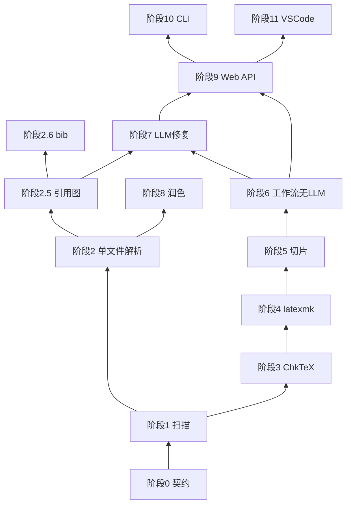

# TeX_Agent LaTeX 子系统分阶段实现路线图

> 版本：v0.2  
> 用途：在 [TeX_Agent LaTeX 诊断与润色子系统设计（增量版）.md](./TeX_Agent%20LaTeX%20诊断与润色子系统设计（增量版）.md) 之上，给出**自底向上、每步尽量少做**的落地顺序。  
> 原则：**先冻结契约 → 再纯函数/服务 → 再 Tool → 再工作流 → 再 API → 最后编辑器**。  
> **全程要求**：文件路径在 **Linux / Windows** 下行为一致；复杂仓库与引用体系分阶段补齐（见 §1.5、§二附表）。

---

## 一、实施原则（必读）

### 1.1 为什么要自底向上

上层（Web、VS Code、LangGraph 节点）都依赖**稳定的数据形状**。若先写 API 或 Agent，后期改 `DiagnosticIssue` 字段会导致全链路返工。

推荐依赖方向：

```text
契约 (Pydantic/dataclass)
  → 纯逻辑 (latex/* 无 IO)
  → 外部进程封装 (chktex/latexmk)
  → BaseTool 适配
  → workflow JSON
  → TeXAgentCLI / 脚本
  → FastAPI job
  → vscode-extension
```

### 1.2 每步「只做一件事」

| 建议 | 反例 |
|------|------|
| 本步只实现 ChkTeX 解析，不接 LLM | 第一步就写 `/api/latex/diagnose` + ReflectionAgent |
| 本步工作流只有 2 个 tool 节点 | 第一个 PR 就提交 8 个文件 + 扩展改动 |
| 本步用 pytest + 夹具验收 | 只靠手点 Web UI 验证 |

### 1.3 与现有仓库对齐的约定

- **Tool 输入**：继续用 JSON 字符串传入 `run()`（与 `PreflightInputsTool`、`RegisterInputsTool` 一致）。
- **Tool 输出**：`ToolResult.output` 放 JSON 字符串；结构化结果同时写入 `metadata[node_id]`（工作流节点约定）。
- **注册**：新工具加入 `tools/tool_list.py` 的 `_build_base_tools()`，用 `_safe_instantiate` 包裹，缺 TeX 时跳过而非拖垮整库。
- **metadata 键**：只增不改（`__latex_project__`、`__latex_diagnostics__` 等，见设计文档 §2.2）。
- **LLM**：编译修复用 **单轮 `SimpleAgent` + JSON**；润色再考虑 `ReflectionAgent`（Step B-1）。

### 1.4 推荐开发时的「垂直切片」方式

每个阶段结束后，应能用**一种最土的方式**跑通，例如：

```bash
pytest tests/test_latex/... -v
# 或
python -m cli ...   # 阶段后期
python -c "from latex.project_index import build_index; print(build_index('path'))"
```

不要等 Web UI 做完才第一次验证 Tool。

### 1.5 跨平台路径规范（Linux / Windows，全阶段适用）

自阶段 1 起，**禁止**用字符串拼接 `root + "\\" + rel` 或依赖当前 OS 分隔符写死逻辑；统一遵守：

| 规则 | 实现位置 | 说明 |
|------|----------|------|
| 磁盘读写 | `pathlib.Path` | `Path(root).expanduser().resolve()` 后再 `read_text` / `subprocess` 的 `cwd` |
| API / JSON 中的相对路径 | **正斜杠** `weijun/Intro.tex` | `latex/paths.normalize_rel_path()` |
| Tool 入参 | `path` **或** `root` + `rel_path` | `latex/paths.resolve_tex_file()`；`rel_path` 允许 `weijun\Intro.tex` |
| 输出中的 `file` / `rel_path` | POSIX 相对路径 | 与 VS Code / Web 前端无关 OS |
| 子进程 | 参数列表 `argv` | 不用 `shell=True` 拼接用户路径；`cwd` 为解析后的 `root` |
| 测试 | 夹具 + 双风格路径用例 | `tests/test_latex/test_paths.py`；复杂样本 `tests/test_latex/VaLoRA_TMC/` |

**后续阶段（3–11）** 凡涉及 `root`、`main_tex`、log 内 `file:line` 映射，均复用 `latex/paths.py`，不得另起一套路径规则。

### 1.6 复杂仓库与「引用解读」能力分层

真实论文目录（如 `VaLoRA_TMC`）通常同时具备：**多 tex 根/子工程**、`\input` 树、**跨文件 `\ref`**、**\cite key**、**\bibliography{*.bib}**。能力分三层，避免「只开一个 tex」就期望看到完整引用信息：

| 层级 | 用户可见能力 | 阶段 | 单文件 `.tex` 是否够 |
|------|----------------|------|----------------------|
| **A. 文件图** | 有哪些 tex、谁 `\input` 谁、`main.tex` 候选 | **1**（已实现） | 否，需目录扫描 |
| **B. tex 内符号** | 章节、`\label`、`\ref`、`\cite{key}` 出现位置 | **2** + **2.5**（已完成） | 单文件 `structure.refs`；跨文件见 `ProjectIndex` |
| **C. 文献元数据** | key → 标题/作者（来自 `.bib`） | **2.6**（已完成） | 否，必须读 `.bib` |
| **D. 编译期真理** | 未定义 ref、Bib 未跑通、致命错误行号 | **4** + log 解析 | 否，需 `latexmk` |

**说明**：`\cite{zhu2023minigpt}` 在 tex 里只是一个 **key 字符串**；条目正文在 `reference.bib`，阶段 2 的 `structure.citations` **不等于** 参考文献内容。完整「解读」= B +（可选 C）+（可选 D）。

---

## 二、分层与阶段总览

```text
阶段 0  契约 + 常量                    [已完成]
阶段 1  项目扫描 (ProjectIndex)        [已完成]
阶段 2  单文件解析 (LaTeXParserTool)   [已完成]
阶段 2.5 全项目 label/ref/cite 索引   [已完成]
阶段 2.6 .bib 解析与 cite 对齐        [已完成]
阶段 2.7 导言区宏 / 版式 / 算法约定   [已完成]
阶段 3  TeX 环境探测 + ChkTeX          [已完成]
阶段 4  Latexmk + log 解析（含引用类警告） [已完成]
阶段 5  Issue 合并与源码切片          [已完成]
阶段 6  诊断工作流（无 LLM）          [已完成]
阶段 7  PromptBuilder + LLM 修复（L3，依赖 2.5 脏区级联）
阶段 8  润色工作流（独立）
阶段 9  Web Job API
阶段 10 CLI 批处理
阶段 11 VS Code（实时 / 幽灵文本）
```



### 实现状态速查

| 阶段 | 状态 | 关键模块 |
|------|------|----------|
| 0 | 已完成 | `latex/models.py`, `constants.py`, `serialize.py` |
| 1 | 已完成 | `latex/project_index.py`, `latex/paths.py`, `tools/latex_project_tool.py` |
| 2 | 已完成 | `latex/structure_extract.py`, `syntax_check.py`, `tools/latex_parser.py` |
| 2.5 | 已完成 | `latex/refs_index.py` |
| 2.6 | 已完成 | `latex/bib_index.py` |
| 2.7 | 已完成 | `latex/conventions_index.py` |
| 3 | 已完成 | `latex/tex_env.py`, `latex/chktex_parser.py`, `latex/chktex_runner.py`, `tools/chktex_tool.py` |
| 4 | 已完成 | `latex/log_parser.py`, `latex/latexmk_runner.py`, `tools/latexmk_tool.py` |
| 5 | 已完成 | `latex/issues.py`, `latex/slice.py`, `latex/dirty.py`, `tools/latex_slice_tool.py` |
| 6 | 已完成 | `config/workflow/workflow_latex_diagnose_v0.json`, `tools/latex_merge_tool.py`, `tools/latex_report_tool.py` |

---

## 三、各阶段说明

以下每节包含：**目标**、**本步实现范围**、**建议新增/修改文件**、**接口要冻结什么**、**验收**、**本步明确不做**。

---

### 阶段 0：契约与包骨架（无业务 IO）— 已完成

**目标**：全项目对「问题 / 建议 / 项目图」说法一致；后续阶段只填实现，不改字段名。

**本步实现范围**

- 新建 `latex/` 包（可全部是先返回空列表的 stub）。
- 用 **Pydantic v2** 或 `dataclass` 定义：
  - `DiagnosticIssue`（对应设计文档 §6.1）
  - `Suggestion`（§6.2）
  - `ProjectIndex` / `ProjectFile` / `LabelRef`（§3.2 子集即可）
- `latex/constants.py`：`METADATA_KEYS`、`IssueSource`、`Severity` 枚举。
- `latex/serialize.py`：`to_json()` / `from_json()`，供 Tool 与测试复用。

**建议文件**

```
latex/__init__.py
latex/models.py          # DiagnosticIssue, Suggestion, ProjectIndex, ...
latex/constants.py
latex/serialize.py
tests/test_latex/test_models.py
```

**接口冻结（本阶段末不应再改）**

- `DiagnosticIssue.id` 生成规则：`{source}:{rel_path}:{line}:{column}`
- `Suggestion.range` 与 VS Code 一致：`line`/`character` 0-based
- metadata 键名常量

**验收**

```bash
pytest tests/test_latex/test_models.py -v
```

**本步不做**：chktex、latexmk、LangGraph、FastAPI。

---

### 阶段 1：项目扫描（ProjectIndex，P0 解析）— 已完成

**目标**：用户给一个目录（路径兼容 Linux / Windows），得到 `main.tex` 候选、文件依赖图、文件 checksum。

**已实现**

- `latex/project_index.py`：`build_project_index()`、`extract_inputs()`、`iter_tex_files()`
- `latex/paths.py`：`normalize_rel_path()`、`resolve_tex_file()`（**全阶段路径入口**）
- `tools/latex_project_tool.py`：入参 `root`；可选 `main_tex`（正斜杠或反斜杠均可）

**复杂目录行为说明（以 `tests/test_latex/VaLoRA_TMC` 为例）**

| 现象 | 是否正常 | 处理建议 |
|------|----------|----------|
| 扫描到 20+ 个 `.tex`，含 `weijun/`、`Response/` | 是 | 文件图包含全部 tex |
| 多个 `\documentclass` → `main_tex=None` | 是 | 调用方传 `"main_tex":"paper.tex"`（可与 `Makefile` 中 `P=paper` 一致） |
| `paper.tex` → 16 个 `\input{weijun/...}` 边齐全 | 是（指定 main 后） | 主论文闭包约 17 个文件 |
| `Highlight.tex` 等与 `paper.tex` 不连通 | 是 | 视为**并行子工程/碎片**，非 bug |
| 注释掉的 `% \input{42copy}` 仍出现边 | 阶段 1 局限 | 阶段 1 小改：去注释后再抽 `\input`；或阶段 6 后 |
| 不扫描 `.bib` / `.cls` | 阶段 1 范围 | `.bib` 见 **阶段 2.6** |

**验收（已通过）**

- `tests/fixtures/latex/multifile/`
- `tests/test_latex/test_project_index.py`
- 手工：`build_project_index(".../VaLoRA_TMC", main_tex="paper.tex")`

**本步不做**：`\label`/`\ref` 全项目图（→2.5）、ChkTeX、Web API。

---

### 阶段 2：单文件结构解析（LaTeXParserTool MVP）— 已完成

**目标**：对**单个** `.tex`（通过 `path` 或 `root`+`rel_path`，跨平台）提取章节、轻量语法、可选 AST。

**已实现**

- `tools/latex_parser.py`：`LaTeXParserTool`（`latex_parser`）
- `latex/structure_extract.py`：`\section` 等、`\label`、`\cite{key}`（**仅 key 列表**）、`figure`/`table` 环境
- `latex/syntax_check.py`：括号、` \begin/\end` 顺序
- `latex/ast_parse.py`：`pylatexenc`（`requirements.txt` 已声明）
- 单文件 `structure` **不含** `\ref{...}` 列表（留给 2.5 统一建模）

**推荐验收样本**

```json
{"root": "tests/test_latex/VaLoRA_TMC", "rel_path": "weijun/Intro.tex"}
{"root": "tests/test_latex/VaLoRA_TMC", "rel_path": "weijun\\Appendix.tex"}
```

| 文件 | 阶段 2 可解析 |
|------|----------------|
| `weijun/Intro.tex` | 章节 + 大量 `\cite{key}`（**非** bib 正文） |
| `weijun/Appendix.tex` | `\label`（如 `fig:templatepdf`）；**尚不输出** 第 50 行 `\ref{fig:templatepdf}` |
| `paper.tex` | 前言区 + `\bibliography{reference.bib}` 字符串（**不打开** bib） |

```bash
pytest tests/test_latex/test_paths.py tests/test_tools/test_latex_parser.py -v
```

**本步明确不做**

- 全项目 `ProjectIndex.labels` / `refs` 填充（→ **2.5**）
- `.bib` 条目字段（→ **2.6**）
- 跨文件「`\ref` 是否指向已定义 `\label`」（→ **2.5** + 可选 **4** 编译 log）

---

### 阶段 2.5：全项目 label / ref / cite 索引（引用结构）— 已完成

**目标**：在**目录 + 主文件闭包**（或全项目 tex）上构建引用图，支撑复杂仓库的「解读」与阶段 7 脏区级联；路径规则同 §1.5。

**本步实现范围**

- 新建 `latex/refs_index.py`（建议）：
  - 遍历 `ProjectIndex.files` 或 `main_tex` 可达闭包内每个 tex
  - 逐行去注释后匹配：`\label`、`\ref` / `\eqref` / `\pageref`、`\cite` / `\citep` 等
  - 填充 `ProjectIndex.labels: Dict[str, LabelDef]`（key → 定义文件与行号）
  - 填充 `ProjectIndex.refs: List[RefEntry]`（含 `kind`: `ref` | `cite`）
- 扩展 `build_project_index()` 或 `enrich_project_index(index)` 一步完成
- 可选诊断（纯本地）：
  - `ref` 指向未定义 `label`
  - `cite` key 在 tex 中出现但 **2.6 未做前** 不校验 bib 是否存在
- 单文件 `latex_parser` 的 `structure` 可增加 `refs: [...]`，与 2.5 字段对齐

**与阶段 2 的分工**

| 项目 | 阶段 2 | 阶段 2.5 |
|------|--------|----------|
| 范围 | 当前 tex | 项目内多 tex（建议 main 闭包） |
| `\label` | `structure.labels[]` | `ProjectIndex.labels` 全局字典 |
| `\ref` | 不输出 | `ProjectIndex.refs` + 未定义检测 |
| `\cite` key | `structure.citations[]` | `RefEntry(kind=cite)` + 可对接 2.6 |

**验收**

- 夹具 `tests/fixtures/latex/cross_ref/`（`main.tex` + 子文件）
- **集成**：`VaLoRA_TMC` + `main_tex=paper.tex`
  - `Appendix.tex` 中 `\ref{fig:templatepdf}` 与 `weijun/LoRAGeneration.tex` 等处的 `\label{fig:VaLoRA}` 可跨文件关联
  - 未定义 ref 产出 `DiagnosticIssue(source=parser)`（可选）
- `tests/test_latex/test_refs_index.py`；路径用例含 `rel_path` 反斜杠

**本步不做**：解析 `.bib` 正文（→2.6）、编译验证（→4）。

**优先级**：建议在 **阶段 6 之前**完成；阶段 7 的跨章节脏区依赖此图。

---

### 阶段 2.6：Bibliography（.bib）解析与 cite 对齐 — 已完成

**目标**：把 tex 中的 `\cite{key}` 与 `reference.bib`（及 `\bibliography{}` 声明）对齐，提供**文献元数据解读**；仍不替代 BibTeX 编译。

**背景**：像 `VaLoRA_TMC` 这类项目，引用信息主要在 `reference.bib`（数千行），**仅解析单个 tex 永远看不到标题/作者**。

**本步实现范围**

- `latex/bib_index.py`：
  - 从 `main.tex` 解析 `\bibliography{foo}` / `\addbibresource`（首版可只支持 `.bib`）
  - 在 `root` 下解析 `foo.bib`（路径用 `resolve_tex_file` / `normalize_rel_path`）
  - 提取 `@article{key, ...}` 等条目的 `key`、`title`、`author`（MVP 正则或 `bibtexparser` 可选依赖）
- 扩展 `ProjectIndex` 或 metadata：
  - `bibliography_files: list[str]`
  - `bib_entries: Dict[str, BibEntry]`（新建轻量模型，阶段 0 可加 `BibEntry`）
- 诊断：tex 中 `\cite{missingKey}` 但 bib 中无条目 → `DiagnosticIssue` warning

**验收**

- `VaLoRA_TMC`：`Intro.tex` 中 cite key 能在 `reference.bib` 中找到条目（抽样 ≥5 个）
- 故意缺失 key 产生 warning

**本步不做**：BibTeX 样式、`.bbl` 生成、多 bib 合并策略（可后续补）。

**依赖**：2.5 的 cite 索引；路径仍走 `latex/paths.py`。

---

### 阶段 2.7：导言区宏 / 版式 / 算法约定 — 已完成

**目标**：识别项目「方言」——`paper.tex` 导言区的 `\newcommand`、`\renewcommand`、`\newtheorem`、`\usepackage`、算法 `Input/Output` 标签改写，以及正文中的宏用法与局部 `\setlength`。

**已实现**

- `latex/conventions_index.py`：`parse_preamble()`、`build_conventions()`、`enrich_conventions()`
- `ProjectIndex.conventions`：`ProjectConventions`（宏定义 + `expands_to_hint` 语义提示 + `macro_usage` + `local_typography`）
- 默认随 `build_project_index(enrich=True)` 一并填充

**本步不做**：完整 TeX 宏展开、`.cls` 深度解析、ChkTeX 规则定制（可后续与阶段 3 联动）。

---

### 阶段 3：TeX 环境探测 + ChkTeXTool — 已完成

**目标**：本地静态诊断 L1；无 TeX 时优雅降级。

**已实现**

- `latex/tex_env.py`：`probe_tex_env()` → `TexEnvStatus`
- `latex/chktex_parser.py`：解析 `-v0` / `-v1` / lacheck 行 → `DiagnosticIssue`
- `latex/chktex_runner.py`：`run_chktex()`，argv 列表、`cwd=root`、单文件超时
- `tools/chktex_tool.py`（`chktex`）：已注册 `tool_list`；metadata `__latex_diagnostics__`
- `config/settings.py`：`latex_chktex_timeout_sec` 等（可用环境变量覆盖）

**验收**

```bash
pytest tests/test_latex/test_chktex_parser.py tests/test_latex/test_tex_env.py tests/test_tools/test_chktex_tool.py -v
pytest -m integration tests/test_tools/test_chktex_tool.py -v  # 需本机 chktex
```

**本步不做**：latexmk、工作流、LLM。

---

### 阶段 4：LatexmkTool + log 解析（L2 fast）— 已完成

**目标**：试编译并产出 `DiagnosticIssue(source=latexmk)`；**编译期**未定义引用、文献引用警告以 log 为准（补充 2.5/2.6 静态分析）。

**已实现**

- `latex/log_parser.py`：`parse_latex_log()`（`!` 错误、`l.N`、`file.tex:line:`、未定义 ref/cite）
- `latex/latexmk_runner.py`：`run_latexmk()`，argv 列表、`cwd=root`、fast/full 模式
- `tools/latexmk_tool.py`（`latexmk`）：已注册；输出 `issues`、`success`、`log_tail`

**验收**

```bash
pytest tests/test_latex/test_log_parser.py tests/test_tools/test_latexmk_tool.py -v
pytest -m latex_integration tests/test_tools/test_latexmk_tool.py::test_latexmk_integration_broken_braces -v
```

**本步不做**：多轮 latexmk 收敛说明 UI、LLM、Web。

---

### 阶段 5：Issue 合并与源码切片 — 已完成

**目标**：为 L3 准备「报错行 ±N 行」上下文；仍不调用 LLM。

**已实现**

- `latex/issues.py`：`merge_issues()` / `merge_issue_lists()`（同文件同行同源保留 severity 最高）
- `latex/slice.py`：`IssueSlice`、`slice_around_issue()`、`slice_issues()`
- `tools/latex_slice_tool.py`（`latex_slice`）：已注册 `tool_list`；支持 `issues` / `issue_ids` / `severity` 过滤
- `latex/dirty.py`：`compute_file_dirty()`、`baseline_from_index()`（文件级 checksum，写入 `__latex_dirty__` 占位）
- `config/settings.py`：`latex_slice_context_lines`（默认 10）

**接口冻结**

- `IssueSlice`：`issue_id`、`file`、`start_line`、`end_line`、`snippet`、`context_lines`

**验收**

```bash
pytest tests/test_latex/test_merge_issues.py tests/test_latex/test_slice.py tests/test_latex/test_dirty.py -v
```

**本步不做**：Prompt、Agent。

---

### 阶段 6：诊断工作流（无 LLM）— 已完成

**目标**：用现有 LangGraph 串起阶段 1–5；用户通过 `main.py` / Web 选 workflow 即可拿到 issues JSON。

**已实现**

- `config/workflow/workflow_latex_diagnose_v0.json`（**v0 无 Agent**，纯 Tool 链）：
  1. `latex_project` → 2. `chktex` → 3. `latexmk` → 4. `latex_merge` → 5. `latex_slice`（仅 `severity=error`）→ 6. `latex_report`
- `config/workflow_registry.json` 已注册 `latex_diagnose_v0`
- `tools/latex_merge_tool.py`、`tools/latex_report_tool.py`；`workflow/nodes.py` 将 Tool 产出的 `__latex_project__` / `__latex_diagnostics__` 提升到顶层 metadata

**用户输入（task 参数）**：JSON 字符串，至少含 `root`；建议同时传 `main_tex`（latexmk 必填或可由扫描推断）。

**验收**

```bash
pytest tests/test_workflow/test_latex_diagnose_v0.py -v -m "not slow"
python main.py task --wf latex_diagnose_v0 "{\"root\":\"tests/fixtures/latex/multifile\",\"main_tex\":\"main.tex\"}"
```

**本步不做**：`/api/latex/*`、LLM fix、润色。

---

### 阶段 7：PromptBuilder + L3 修复（单轮 SimpleAgent）

**目标**：对**每条** error 级 issue 生成 0–1 条 `Suggestion`；控制 Token。

**本步实现范围**

- `latex/prompt_builder.py`：`build_fix_prompt(issue, snippet, project_meta) -> str`（`project_meta` 含 2.5 引用图：受影响 `\ref` 所在文件片段）
- `latex/suggestion.py`：`parse_llm_suggestion_json(text) -> Suggestion | None`（容错）
- 升级工作流为 `workflow_latex_diagnose_v1.json`：
  - 在 slice 后增加 `fix_agent`（`SimpleAgent`，system_prompt 要求**只输出 JSON 数组**）
  - **限制**：首版可对 `severity=error` 且最多前 **5** 条 issue 调 LLM（配置写在 node config）
- 写入 `metadata["__latex_suggestions__"]`

**接口扩展**

- `Suggestion` 已有字段不动；可增加可选 `issue_id` 关联

**验收**

- Mock LLM 返回固定 JSON 的集成测试
- 手工 1 个真实项目：issues + suggestions 均有 `replacement`

**本步不做**：Reflection 多轮、润色、VS Code。

---

### 阶段 8：润色工作流（与诊断解耦）

**目标**：章节 + checklist → 润色建议（可不生成 `replacement` 自动替换）。

**本步实现范围**

- 复用 `latex_project` + `latex_parser`（按 `section` 切块）
- 复用 `file_loading` 读 `thesis-checklists.md` 或 `storage/checklists/*`
- `workflow_latex_polish_v1.json`：
  - `SimpleAgent` 单轮即可（首版）
  - 输出：`list[Suggestion]` 且 `source=llm_polish`，`replacement` 可为空，以 `rationale_zh` 为主
- 注册 `latex_polish_v1`

**验收**：指定 `root` + `section=Method`，输出非空建议列表。

**本步不做**：Web 专用路由（可与阶段 9 合并）、InlineCompletion。

---

### 阶段 9：Web Job API（目录模式 MVP）

**目标**：异步诊断，不阻塞 `/api/chat`。

**本步实现范围**

- `latex/job_store.py`：内存 dict 即可（`job_id`, status, result, error）
- `ui/web/server.py` 增加：
  - `POST /api/latex/projects/scan`
  - `POST /api/latex/diagnose` → 后台 `asyncio.create_task` 跑 `TeXAgentCLI` 或 `graph.invoke`
  - `GET /api/latex/jobs/{job_id}`
- 首版 **可不实现 SSE**；轮询 GET 即可

**接口冻结**

- Job 响应 JSON 形状与 §7 设计一致
- `cancelled` 状态可先占位

**验收**：`curl` 启动 job → 轮询至 `completed` → body 含 `diagnostics` + `suggestions`。

**本步不做**：VS Code、编辑器防抖。

---

### 阶段 10：CLI 批处理

**目标**：不启 Web 也能扫目录。

**本步实现范围**

- `check_latex.py` 或 `python -m latex.diagnose_cli`：
  - 读 `config/run_config_latex.example.json`（`root`, `workflow`, `main_tex`）
  - 输出 `files/output_latex/report.json`
- 退出码约定：与 `check.py` 类似（0 全成功 / 1 有 issues / 2 环境缺失）

**验收**：CI 可只跑 `latex_diagnose_v0` + Mock。

**本步不做**：扩展。

---

### 阶段 11：VS Code 扩展（实时）

**目标**：Diagnostics；幽灵文本为可选子步。

**建议再拆两步**

| 子步 | 内容 |
|------|------|
| 11a | 打开 `.tex` 时调 `POST .../diagnose`（整文件或 root）；`DiagnosticCollection` 展示 issues |
| 11b | `document_version` + 防抖调 API；`InlineCompletionItemProvider` 展示 `replacement` |

**本步实现范围（11a 优先）**

- `vscode-extension` 增加配置 `texagent.latexProjectRoot`
- 调用阶段 9 API，映射到 `vscode.Diagnostic`

**本步不做**：LSP、SyncTeX、扩展内嵌 latexmk。

---

## 四、阶段依赖与可并行项

| 可并行 | 说明 |
|--------|------|
| 阶段 2 与 3 | 不同开发者：解析 vs chktex，但都依赖阶段 0 |
| 阶段 8 与 7 | 润色工作流可在诊断 LLM 完成后并行 |
| 阶段 10 与 9 | CLI 可在 API 稳定后快速跟进 |

**串行硬依赖**：`0 → 1 → 2 → 2.5 → (2.6 可选) → 3 → 4 → 5 → 6 → 7 → 9 → 11`。

**说明**：阶段 2 与 3 可并行；**2.5 必须在 7 之前**（跨文件脏区）；2.6 与 3/4 可并行。

---

## 五、每个 Tool 的输入/输出约定（实现时抄这份）

| tool_name | 输入 JSON 必填字段 | 输出 JSON 主字段 |
|-----------|-------------------|------------------|
| `latex_project` | `root`（`~`、盘符、`/`、`\` 均可）；可选 `main_tex` | `project`（ProjectIndex）；复杂库需传 `main_tex` |
| `latex_parser` | `path` **或** `root`+`rel_path`（`rel_path` 允许 `\`）；或 `latex_source` | `structure`（sections/labels/citations/figures）、`syntax_issues`、`diagnostics`、`ast` |
| `chktex` | `root`；可选 `files[]`、`main_tex` | `issues[]`, `env` |
| `latexmk` | `root`, `main_tex`；可选 `mode` | `issues[]`, `success`, `log_tail` |
| `latex_slice` | `root`, `issues[]` 或 `issue_ids[]` | `slices[]` |
| `latex_report`（可选） | metadata 引用 | `report` 汇总 |

所有 Tool 的 `run()` 失败应返回 `ToolResult(success=False, error=...)`，**不要**抛到 LangGraph 未捕获（与现有工具一致）。

---

## 六、测试与夹具清单（随阶段递增）

```
tests/fixtures/latex/
  minimal_main.tex
  broken_braces.tex
  multifile/
    main.tex
    chapters/intro.tex
  cross_ref/                # 阶段 2.5
  with_bib/                 # 阶段 2.6
    main.tex
    fig.tex
tests/test_latex/
  VaLoRA_TMC/               # 复杂真实论文树（集成测试，需 main_tex=paper.tex）
  test_paths.py             # Linux/Windows 路径风格
  test_project_index.py
  test_models.py
tests/test_tools/
  test_latex_parser.py      # 含 VaLoRA Intro / Appendix
```

| 阶段 | 新增测试 |
|------|----------|
| 0 | `test_models.py` |
| 1 | `test_project_index.py`；手工/VaLoRA 集成 |
| 2 | `test_latex_parser.py`、`test_paths.py` |
| 2.5 | `test_refs_index.py`；`VaLoRA_TMC` 跨文件 `\ref`/`\label` |
| 2.6 | `test_bib_index.py`；`VaLoRA_TMC` cite key ↔ `reference.bib` |
| 3–4 | `test_chktex_parser.py`, `test_log_parser.py` + integration mark |
| 5 | `test_slice.py`, `test_merge_issues.py`, `test_dirty.py`（已通过） |
| 6 | `tests/test_workflow/test_latex_diagnose_v0.py`（已通过，含 merge/report；e2e 需 openai 依赖） |
| 6–7 | `test_workflow_latex_diagnose.py`（Mock LLM，阶段 7） |
| 9 | `test_latex_api.py`（FastAPI TestClient） |

---

## 七、配置项建议（集中放在 `config/settings.py`）

实现阶段 3 起逐步加入，避免硬编码：

```python
LATEX_CHKTEX_TIMEOUT_SEC = 30
LATEX_LATEXMK_FAST_TIMEOUT_SEC = 120
LATEX_LATEXMK_FULL_TIMEOUT_SEC = 600
LATEX_LLM_MAX_ISSUES_PER_RUN = 5
LATEX_SLICE_CONTEXT_LINES = 10
```

---

## 八、PR / 合并建议（降低返工）

1. **一个阶段一个 PR**（或至少一个可合并的垂直切片）。
2. PR 描述里写：本 PR 对应路线图「阶段 N」，验收命令是什么。
3. 未完成的下一阶段接口用 `NotImplementedError` 或文档注释标 `@future`，不要留半实现 API 给 Web 调用。
4. 设计文档 §6 字段变更时，**先改阶段 0 的 models + 测试**，再改上层。

---

## 九、最小可用产品（MVP）定义

达到以下四条即可对外演示「目录诊断」：

1. 阶段 6：`latex_diagnose_v0` 在 CLI/Web workflow 可跑通，输出 issues 列表。
2. 阶段 3：本机有 TeX 时 ChkTeX issues 非空（对故意写错的夹具）。
3. 阶段 9：`POST /api/latex/diagnose` 可轮询拿到 JSON。
4. 阶段 7 可**延后**：无 LLM 时仍算 MVP，仅无 `replacement` 建议。

润色、幽灵文本、实时防抖均 **不属于 MVP**。

---

## 十、与设计文档里程碑的对应

| 设计文档 §10 | 本路线图 |
|--------------|----------|
| M1 | 阶段 1 + 2（**已完成**） |
| M1+ | 阶段 2.5（+ 可选 2.6）复杂结构与引用解读 |
| M2 | 阶段 3 + 6 |
| M3 | 阶段 4 + 6 |
| M4 | 阶段 7 + 9 |
| M5 | 阶段 8 |
| M6 | 阶段 11 |

---

## 十一、常见陷阱（实现时避开）

1. **在 Tool 里调 LLM**：应只在 Agent 节点；Tool 保持确定性。
2. **用 `CommandRunningTool` 直接跑 latexmk**：超时 30s 不够；且 `shell=True` 不利于路径安全；单独封装。
3. **整篇 tex 送入 LLM**：阶段 7 必须按 issue 切片 + 条数上限。
4. **展平多文件为一棵 AST**：行号对不上；坚持 ProjectIndex + 相对路径。
5. **先改 vscode-extension**：API 未稳定时扩展会反复改。
6. **用 `os.path.join` 拼项目内相对路径**：一律 `Path(root) / normalize_rel_path(rel)`。
7. **指望单 tex 解析得到 bib 文献摘要**：必须做阶段 **2.6** 或接受仅 cite key 列表。

---

## 十二、复杂样本 `VaLoRA_TMC` 验收清单（随阶段勾选）

仓库路径：`tests/test_latex/VaLoRA_TMC`（Windows / Linux 均可，通过 `root` 传入）。

| 检查项 | 阶段 | 状态 |
|--------|------|------|
| 扫描全部 `.tex`，`main_tex=paper.tex` 时 `\input` 闭包正确 | 1 | 已通过 |
| `rel_path` 使用 `weijun\Intro.tex` 与 `weijun/Intro.tex` 均可解析 | 1–2 | 已通过 |
| 单文件 `Intro.tex` 抽出 `\section` 与 `\cite{key}` | 2 | 已通过 |
| 单文件 `Appendix.tex` 抽出 `\label`，并抽出 `\ref` | 2 / 2.5 | 已通过 |
| 全项目 `\ref{fig:VaLoRA}` 解析到定义所在 tex | 2.5 | 已通过 |
| `\cite` key 在 `reference.bib` 中有对应条目 | 2.6 | 已通过 |
| `latexmk` 报未定义引用 / 文献警告 | 4 | 已通过（log 解析） |

---

## 附录：阶段检查清单（可复制到 PR）

```markdown
- [ ] 仅包含路线图阶段 N 的范围
- [ ] 新增/更新了 pytest，本地通过
- [ ] 未改动无关 workflow
- [ ] tool_list 注册且缺依赖时可跳过
- [ ] metadata 键使用 constants 中的常量
- [ ] 设计文档 §6 字段未破坏性变更（若变更则先改 test_models）
- [ ] 路径：入参/出参经 `latex/paths.py`，测试含 `\` 与 `/` 两种 rel_path
- [ ] 若触及引用：区分 tex 内 key 与 .bib 正文，未越阶段承诺
```
