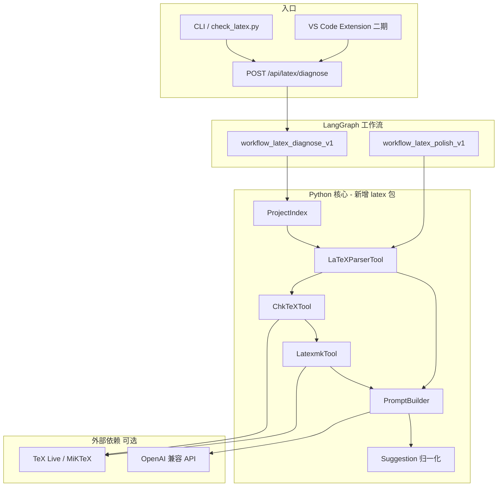

# TeX_Agent LaTeX 诊断与润色子系统设计（增量版）

> 版本：v0.1（草案）  
> 状态：与主仓库 `Tex_Agent` 增量对齐，非替代既有 PDF checklist 审查链路  
> 关联文档：`doc/TeX_Agent 核心系统设计方案：LaTeX 结构理解与智能诊断体系.md`（初稿）

---

## 一、目标与范围

### 1.1 产品目标

在**不推翻**现有 LangGraph + Tool + Web-ui 架构的前提下，为 LaTeX 项目提供：

1. **识别**：语法/风格/编译类问题（本地优先）
2. **建议**：结构化、可定位、可采纳的修改方案
3. **润色**：基于学术规范 checklist 的章节级表达优化（可选 LLM）
4. **终局体验**：编辑器内类似 VS Code「幽灵文本」的 Inline Suggestion

### 1.2 两种使用形态（分轨实现）

| 形态 | 入口 | 优先级 | 说明 |
|------|------|--------|------|
| **目录模式（MVP）** | 用户提供 LaTeX 根目录 | P0 | 扫描 → 诊断 → 异步 job → Web/CLI 展示 |
| **编辑器实时模式** | VS Code 打开 `.tex` 并编辑 | P1 | 防抖 L1/L2 + Abort + Diagnostic/InlineCompletion |

**原则**：先打通目录模式与工作流/API，再接入扩展实时能力。

### 1.3 非目标（首版不做）

- 完整 Language Server Protocol（LSP）实现
- SyncTeX 正向/反向搜索
- 自动无确认改写用户文件（所有 LLM 产出需显式采纳）

### 1.4 与现有系统的关系

| 能力 | 现有模块 | 本子系统 |
|------|----------|----------|
| PDF 论文审查 | `checklist_multi_*` / `checklist_text_*` | 不重复；可共享 checklist 规则 |
| 命令执行 | `CommandRunningTool` | 封装 `chktex` / `latexmk` |
| LaTeX 解析占位 | `tools/latex_parser.py` | **本设计的主实现落点** |
| 多轮反思 | `ReflectionAgent` | 仅用于**润色**多轮；编译修复用单轮 JSON Agent |
| 工作流 | `config/workflow/*.json` | 新增 `workflow_latex_*` |
| Web | `ui/web/server.py` | 新增 `/api/latex/*` |
| 编辑器 | `vscode-extension/` | 二期：Diagnostic + InlineCompletion |

---

## 二、总体架构



### 2.1 分层职责

| 层 | 目录/模块 | 职责 |
|----|-----------|------|
| 工具层 | `tools/latex_parser.py`（实现子类）、`tools/latex_project_tool.py`、`tools/chktex_tool.py`、`tools/latexmk_tool.py` | 无 LLM 的结构化事实 |
| 服务层 | `latex/`（建议新建）`project_index.py`、`prompt_builder.py`、`suggestion.py` | 项目图、脏区、Prompt、统一 Suggestion schema |
| 编排层 | `config/workflow/workflow_latex_diagnose_v1.json` 等 | 与现有 `graph_builder` 一致 |
| 接口层 | `ui/web/server.py` 新增路由 | 异步 job、SSE 进度 |
| 展示层 | `vscode-extension` | Diagnostics、幽灵文本 |

### 2.2 与 `WorkflowState` 的约定（metadata 键，只增不改）

节点产出写入 `state.metadata`，建议保留键：

```python
# 约定键（示例）
metadata["__latex_project__"]      # 根目录、main.tex、文件 DAG、checksum
metadata["__latex_diagnostics__"]  # L1/L2 合并后的 issues 列表
metadata["__latex_dirty__"]         # 文件 -> [(start_line, end_line), ...]
metadata["__latex_suggestions__"]  # 归一化后的 Suggestion 列表
metadata["__latex_last_good_build__"]  # 上次成功编译的文件 checksum 快照
```

与现有 `metadata[node_id]`、`__execution_order__` 深合并机制兼容（见 `core/state.py`）。

---

## 三、LaTeX 项目理解（ProjectIndex）

### 3.1 原则：不默认「整项目展平」

- 维护**项目图**（多文件、`\input` / `\include`、`.bib`、`.sty`），每个文件保留**真实路径与行号**。
- 「虚拟展平视图」仅用于批量报告导出，**不作为**诊断与 VS Code range 的默认依据。

### 3.2 ProjectIndex 数据结构（逻辑）

```json
{
  "root": "/path/to/project",
  "main_tex": "main.tex",
  "files": {
    "main.tex": { "checksum": "sha256:...", "inputs": ["chapters/intro.tex"] },
    "chapters/intro.tex": { "checksum": "...", "inputs": [] }
  },
  "labels": { "fig:arch": { "defined_in": "chapters/method.tex", "line": 42 } },
  "refs": [{ "key": "fig:arch", "file": "chapters/result.tex", "line": 10 }]
}
```

### 3.3 解析引擎分层（与仓库对齐）

| 层级 | 能力 | 实现建议 |
|------|------|----------|
| P0 | 文件图、label/ref/cite 索引、按章节切块 | 轻量解析 + `FileLoadingTool` |
| P1 | 环境/命令、`LaTeXSyntaxIssue` 行号 | **pylatexenc**（对齐 `latex_parser.py` 注释） |
| P2 | 编辑器级增量 AST diff | 评估 tree-sitter-latex（后续） |

**说明**：前端正则（L0）仅用于括号/环境高亮，**不属于** P1 结构理解。

### 3.4 脏区检测（MVP → 增强）

| 阶段 | 策略 |
|------|------|
| MVP | 文件 mtime/checksum + 行级 diff（相对 `__latex_last_good_build__`） |
| 增强 | AST 节点级 dirty + 依赖图级联（`\label` 删除 → 激活所有 `\ref` 所在块） |

### 3.5 局部上下文与 RAG 隔离

- 当前论文草稿：**仅**进入 `ProjectIndex` / 内存 dict，**不**写入 Chroma 论文库。
- 外部 arXiv/专家 checklist：继续走现有 `RAGPipeline` 与 `storage/checklists`，通过 Tool 显式检索。
- Prompt 中章节元数据来自 `extract_structure()`，而非向量库全文。

---

## 四、多级诊断链路

```text
[变更] → L1 静态(ChkTeX) → L2 试编译(latexmk，可选) → 切片 → L3 LLM（按 issue）
```

### 4.1 L1：ChkTeXTool

- 封装 `CommandRunningTool`，对 `main.tex` 或指定文件运行 `chktex`。
- 解析输出为统一 `DiagnosticIssue`（见第六节）。
- 超时默认 30s；全项目扫描可放宽至 120s（`config/settings.py` 可配置）。

### 4.2 L2：LatexmkTool（分策略）

| 策略 | 命令意图 | 适用 |
|------|----------|------|
| **fast** | `latexmk -pdf -interaction=nonstopmode -draftmode` 或单次 pdflatex | 目录模式快速探测、编辑器 L2 |
| **full** | `latexmk -pdf -interaction=nonstopmode` | 用户手动「完整编译检查」；交叉引用/Bib 收敛 |

- 从 `.log` 提取 `!` 致命错误行 + 行号；映射回**源文件**（多文件时解析 `main.log` 中的 file:line）。
- **注意**：draft 模式无法发现全部 `\ref` 未定义问题，文档与 UI 需标注能力边界。

### 4.3 L3：LLM 切片策略

- **每个** L1/L2 issue 一条请求（或同文件相邻 issue 合并），禁止整篇 20 页送入。
- 上下文 = 报错行 ±10 行 + 章节元数据 + 可选关联 `\ref` 目标文件片段（依赖图激活时）。
- 输出必须为 **Suggestion JSON**（第六节），禁止自由 Markdown 作为主接口。

### 4.4 两类 LLM 工作流分离

| 工作流 | Agent | 输入 | 输出 |
|--------|-------|------|------|
| `workflow_latex_diagnose_v1` | `SimpleAgent`（低温、JSON mode） | log + 切片 | `replacement` 修复建议 |
| `workflow_latex_polish_v1` | `ReflectionAgent` 或 2 轮 SimpleAgent | 章节块 + checklist 片段 | 润色建议列表（可不自动替换全文） |

编译修复：**单轮**即可；润色：可多轮，控制 `MAX_REFLECTION_ROUNDS=2`。

---

## 五、实时交互（编辑器模式，二期）

### 5.1 阶梯触发

| 层级 | 触发 | 动作 | 用户感知 |
|------|------|------|----------|
| L0 | 按键 | 扩展内正则/括号配对 | 毫秒级高亮 |
| L1 | 停顿 > 0.5s | ChkTeX 当前文件或内存规则 | 波浪线诊断 |
| L2 | 静默 > 3s | latexmk fast（后台） | 无感或状态栏 |
| L3 | L2 失败 / 手动 | LLM + Abort | 幽灵文本 / CodeAction |

### 5.2 取消与过期（Stale）

- HTTP：`AbortController` / 服务端 `asyncio.Task.cancel()`。
- 协议：每个请求带 `document_version`（单调递增）；响应若 `version < 当前` 则丢弃。
- 编译子进程：按 job 记录 PID，新请求到来时 kill 进程组（Windows 需注意 `taskkill /T`）。

### 5.3 VS Code 集成要点

- `DiagnosticCollection`：消费 `DiagnosticIssue`。
- `InlineCompletionItemProvider` 或 CodeLens + Accept：消费 `Suggestion.replacement`。
- 配置项：`texagent.webServerUrl`（已有），新增 `texagent.latexDiagnosticsEnabled` 等。

**Python 不负责画幽灵文本**；只提供结构化 API。

---

## 六、统一数据契约

### 6.1 DiagnosticIssue（L1/L2）

```json
{
  "id": "chktex:main.tex:42:15",
  "file": "chapters/method.tex",
  "line": 42,
  "column": 15,
  "end_line": 42,
  "end_column": 20,
  "severity": "warning",
  "source": "chktex",
  "code": "15",
  "message": "No match found for '}'."
}
```

`severity`: `error` | `warning` | `info`。

### 6.2 Suggestion（L3 / 润色）

```json
{
  "request_id": "550e8400-e29b-41d4-a716-446655440000",
  "document_version": 42,
  "file": "chapters/method.tex",
  "range": {
    "start": { "line": 41, "character": 0 },
    "end": { "line": 43, "character": 80 }
  },
  "severity": "warning",
  "source": "llm_fix",
  "message": "未闭合的右花括号",
  "replacement": "\\begin{equation}\n  E = mc^2\n\\end{equation}",
  "confidence": 0.85,
  "rationale_zh": "根据 ChkTeX 15 与上下文，应在 equation 环境内闭合。"
}
```

`source` 枚举建议：`chktex` | `latexmk` | `llm_fix` | `llm_polish`。

### 6.3 Prompt 模板（脏区组装，示意）

```markdown
【System】
你是 LaTeX 编译修复专家。仅针对给定片段输出 JSON，字段符合 Suggestion schema。

【章节】第 3 章 Method → 3.2 System Architecture

【片段】
...

【报错】
ChkTeX 15: ...

【任务】
返回 1 条 Suggestion JSON，replacement 必须是可替换 range 内内容的合法 LaTeX。
```

实现放在 `latex/prompt_builder.py`，由 Tool/Agent 调用。

---

## 七、对外 API（目录模式 MVP）

在 `ui/web/server.py` 增加（路径示例）：

| 方法 | 路径 | 说明 |
|------|------|------|
| POST | `/api/latex/projects/scan` | body: `{ "root": "..." }` → ProjectIndex |
| POST | `/api/latex/diagnose` | 启动 job，返回 `{ "job_id": "..." }` |
| GET | `/api/latex/jobs/{job_id}` | 状态 + `issues` + `suggestions` |
| GET | `/api/latex/jobs/{job_id}/events` | SSE 进度（可选） |
| POST | `/api/latex/polish` | 指定章节/文件，走润色工作流 |

**与 `/api/chat` 分离**，避免长编译阻塞对话。

### 7.1 Job 状态机

`queued` → `running_l1` → `running_l2` → `running_l3` → `completed` | `failed` | `cancelled`

---

## 八、工作流配置草案

### 8.1 `workflow_latex_diagnose_v1.json`（逻辑节点）

```text
scan_project (tool: latex_project)
  → chktex (tool: chktex)
  → [condition: has_errors] latexmk_fast (tool: latexmk)
  → slice_issues (tool: latex_slice)
  → fix_agent (agent: SimpleAgent, JSON Suggestion[])
  → deliver (tool: offer_artifact / 写 metadata)
```

注册到 `config/workflow_registry.json`，名称示例：`latex_diagnose_v1`。

### 8.2 `workflow_latex_polish_v1.json`

```text
scan_project → extract_section (latex_parser) → load_checklist (file_loading)
  → polish_agent (ReflectionAgent 或 SimpleAgent×2) → deliver
```

---

## 九、环境依赖与安全

### 9.1 外部依赖探测

启动时或 Tool 首次调用时检测：

- `chktex`、`latexmk`、`pdflatex` 是否在 PATH
- 缺失则：跳过 L2，UI 提示安装 TeX Live；L3 标注「无编译上下文」

与 `tools/tool_list.py` 的 `_safe_instantiate` 策略一致。

### 9.2 安全

- `latexmk` / `chktex` 的 `cwd` **限制**在用户声明的 `root` 内。
- 禁止将未校验的用户字符串拼进 shell（使用参数列表而非 `shell=True` 拼接路径）。
- `CommandRunningTool` 若保留 `shell=True`，LaTeX 子工具应使用独立 `subprocess` 封装。

---

## 十、实施里程碑

| 阶段 | 交付物 | 验收标准 |
|------|--------|----------|
| **M1** | `LaTeXParserTool` 实现 + `LatexProjectTool` | 给定目录输出文件图与章节列表 |
| **M2** | `ChkTeXTool` + `workflow_latex_diagnose_v1`（无 L3） | CLI/Web 列出所有 ChkTeX issues |
| **M3** | `LatexmkTool` + log 解析 | 编译失败时 issues 含 log 行号 |
| **M4** | L3 fix Agent + Suggestion schema + `/api/latex/*` | 每条 issue 可返回 `replacement` |
| **M5** | `workflow_latex_polish_v1` + checklist | 章节润色建议 |
| **M6** | VS Code Diagnostics + InlineCompletion | 编辑 .tex 可看到建议并采纳 |

对应 `Framework.md` **Step C-2（LaTeXParserTool）** 及后续扩展项。

---

## 十一、测试策略

| 类型 | 内容 |
|------|------|
| 单元 | `tests/test_tools/test_latex_parser.py`、chktex/latexmk 输出解析 |
| 夹具 | `tests/fixtures/latex/` 含故意错误 `.tex` |
| 集成 | `workflow_latex_diagnose_v1` 端到端（Mock LLM） |
| 手工 | Windows + TeX Live 全链路 |

---

## 十二、开放问题

1. `main.tex` 自动发现启发式（多个候选时 UI 让用户选择）。
2. 中文模板 `ctex` 与 `-draftmode` 兼容性验证。
3. L3 配额：每文件/每日 LLM 调用上限。
4. 是否与 Overleaf 同步项目（远期）。

---

## 附录 A：与初稿文档的差异摘要

| 初稿 | 本增量版 |
|------|----------|
| 默认 AST 展平 | 项目图 + 按需片段 |
| Tree-sitter 为主 | pylatexenc 对齐现有占位 |
| 单一 Reflection 诊断 | 修复单轮 / 润色多轮分离 |
| 强调编辑器防抖 | **目录模式 MVP 优先** |
| 未定义 API/契约 | DiagnosticIssue + Suggestion + `/api/latex/*` |
| L0 正则与「拒绝正则」矛盾 | 明确 L0 仅前端高亮 |

---
